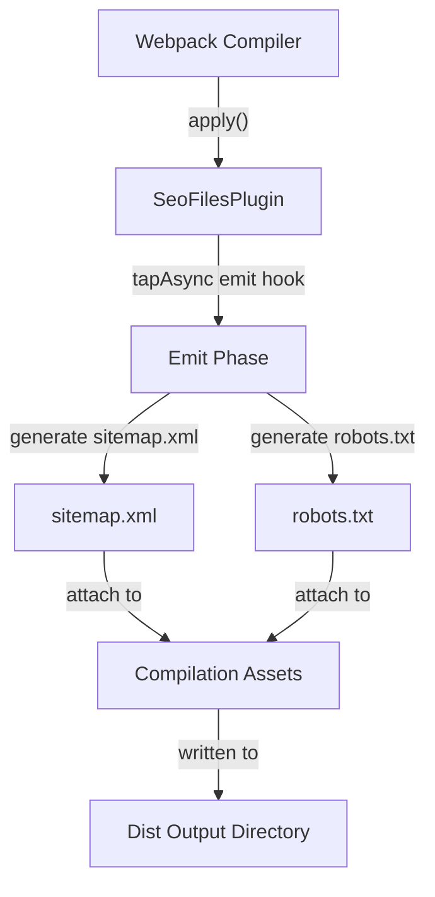
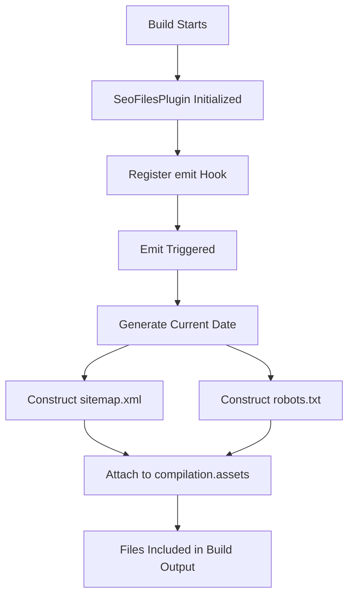

# Module 18

## Overview

**Module 18** provides build-time Search Engine Optimization (SEO) asset generation for the Major League GitHub frontend. It contains a custom Webpack plugin, **SeoFilesPlugin**, responsible for automatically generating `sitemap.xml` and `robots.txt` during the production build process.

By integrating directly into the Webpack compilation lifecycle, Module 18 ensures that SEO-critical files are always synchronized with the deployment environment (such as the configured base URL) and require no manual maintenance.

---

## Purpose and Responsibilities

Module 18 focuses exclusively on:

- ✅ Generating `sitemap.xml`
- ✅ Generating `robots.txt`
- ✅ Injecting generated files into Webpack build assets
- ✅ Supporting configurable deployment base URLs

It does **not**:

- Handle runtime routing
- Interact with backend services
- Perform dynamic sitemap generation
- Depend on frontend React components

This clear separation ensures the SEO configuration remains a **build-time concern**, not a runtime responsibility.

---

## Core Component

### SeoFilesPlugin

The `SeoFilesPlugin` is a custom Webpack plugin that hooks into the `emit` phase of the compilation process.

### Constructor

```javascript
new SeoFilesPlugin({
  baseUrl: "https://www.mlg.soccer"
});
```

#### Configuration Options

| Option   | Type   | Default                     | Description |
|----------|--------|----------------------------|-------------|
| baseUrl  | string | https://www.mlg.soccer     | Base URL used in sitemap and robots references |

If no configuration is provided, the plugin defaults to the production domain.

---

## Build-Time Architecture

The plugin integrates directly into Webpack's compilation lifecycle.



### Key Integration Point

The plugin uses:

- `compiler.hooks.emit.tapAsync(...)`

This ensures that generated files are added just before Webpack finalizes output assets.

---

## Sitemap Generation

During the emit phase:

1. The current date is generated in ISO format.
2. A valid XML sitemap document is constructed.
3. The base URL is injected dynamically.
4. The file is attached to `compilation.assets`.

### Generated Structure

```xml
<?xml version="1.0" encoding="UTF-8"?>
<urlset xmlns="http://www.sitemaps.org/schemas/sitemap/0.9">
  <url>
    <loc>https://www.mlg.soccer/</loc>
    <lastmod>2026-07-24</lastmod>
    <changefreq>daily</changefreq>
    <priority>1.0</priority>
  </url>
</urlset>
```

### Design Characteristics

- Static single-page sitemap
- Always reflects current build date
- Optimized for homepage indexing
- Lightweight and zero external dependencies

---

## Robots.txt Generation

The plugin also generates a minimal and secure `robots.txt` file.

### Generated Content

```text
User-agent: *
Allow: /
Disallow: /api/

Sitemap: https://www.mlg.soccer/sitemap.xml
```

### Behavior

- Allows full frontend crawling
- Explicitly disallows `/api/` routes
- Points search engines to the generated sitemap

This prevents indexing of backend endpoints while enabling search visibility for the public application.

---

## Internal Workflow

The runtime behavior inside the plugin can be summarized as:



---

## Dependency Context

Module 18 operates at the **frontend build layer** and has no direct dependency on:

- Backend services
- API models
- React components
- Application state

Its only runtime dependency is the Webpack compiler interface.

### System Placement


This positioning ensures SEO files are always present in every deployment.

---

## Design Principles

Module 18 follows several architectural principles:

### 1. Build-Time Responsibility
SEO files are generated during build, not at runtime.

### 2. Zero Runtime Cost
No additional HTTP handlers or dynamic generation required.

### 3. Environment Awareness
Supports configurable base URLs for:
- Production
- Staging
- Preview deployments

### 4. Minimal Surface Area
Single-purpose plugin with no cross-cutting concerns.

---

## Extensibility Opportunities

The current implementation generates a minimal sitemap. Future enhancements could include:

- Dynamic route enumeration
- Multi-language sitemap entries
- Additional sitemap priority rules
- Automatic inclusion of contributor pages
- Environment-based robots configuration

These enhancements would still remain within the build-time responsibility of Module 18.

---

## Summary

**Module 18** provides automated SEO asset generation for the Major League GitHub frontend by:

- Hooking into Webpack's emit phase
- Dynamically generating `sitemap.xml`
- Generating a secure `robots.txt`
- Injecting files directly into the build output

Its simplicity, isolation, and deterministic behavior make it a reliable infrastructure component that ensures every deployment remains search-engine friendly without introducing runtime complexity.