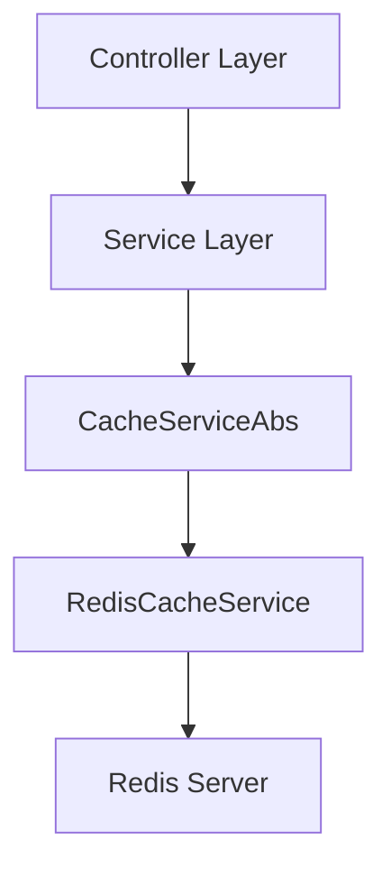
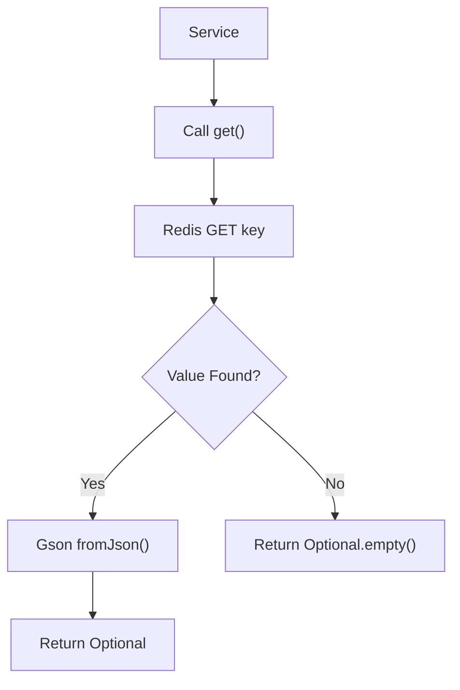
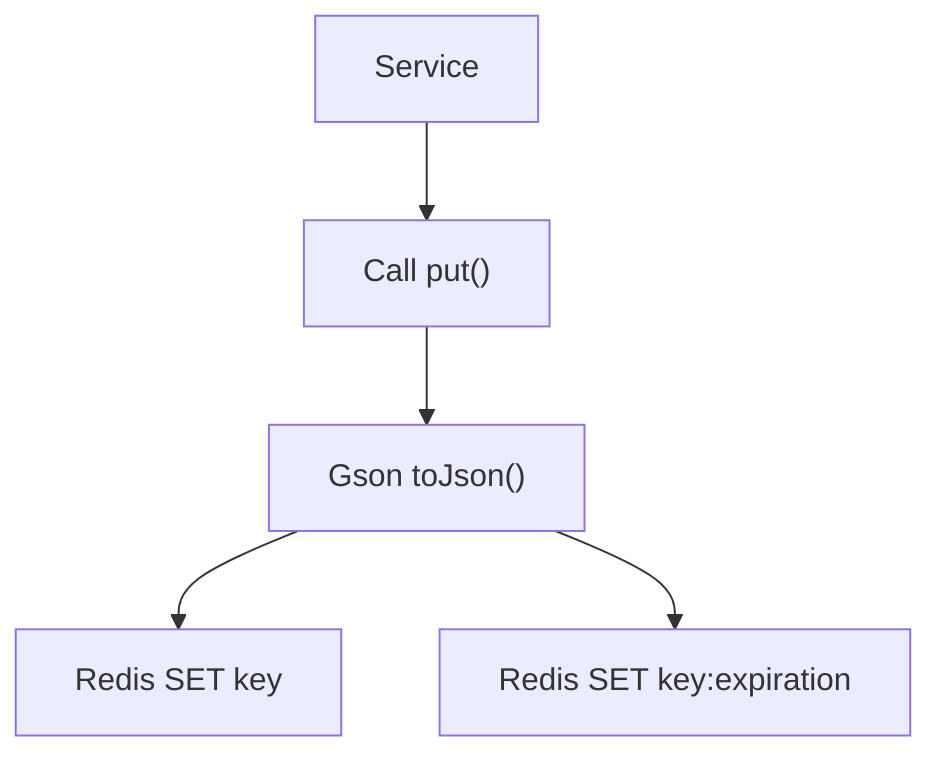
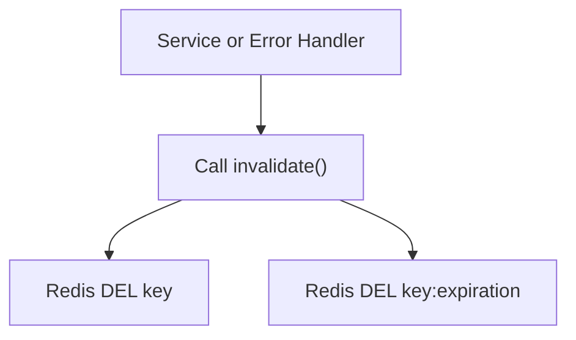
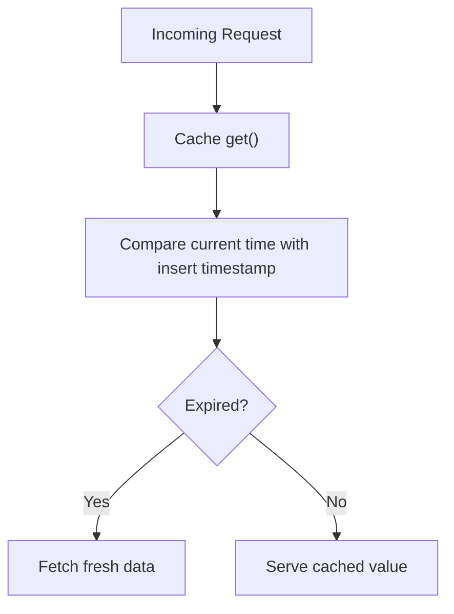
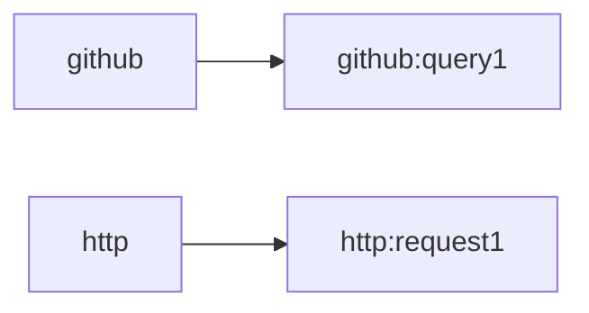

# Cache Layer

The **Cache Layer** module provides a Redis-backed implementation of the application’s caching abstraction. It is responsible for storing, retrieving, and invalidating cached data used by services that interact with GitHub and other HTTP-based integrations.

By centralizing cache behavior behind a common abstraction, the Cache Layer enables:

- Reduced GitHub API calls and rate limit pressure
- Faster response times for frequently requested data
- Controlled cache invalidation and refresh strategies
- Clean separation between business logic and storage concerns

This module specifically implements a distributed cache using Redis and manages expiration metadata for refresh logic.

---

## 1. Architectural Context

The Cache Layer sits between the Service Layer (e.g., GitHub-related services) and the underlying Redis infrastructure. It implements the abstract caching contract defined in the backend core.



### Responsibilities

- Implement distributed caching using Redis
- Serialize and deserialize objects using Gson
- Track insertion timestamps for refresh validation
- Provide cache invalidation support

---

## 2. Core Components

### 2.1 RedisCacheService

**Class:** `RedisCacheService`  
**Package:** `cx.flamingo.analysis.cache.impl`

`RedisCacheService` extends the abstract caching contract and provides a Redis-based implementation using Spring Data Redis.

#### Key Dependencies

- `RedisTemplate<String, Object>` – Redis communication
- `ValueOperations<String, Object>` – Simple key-value operations
- `Gson` – JSON serialization and deserialization
- `Expiration` – Stores insertion timestamp metadata

#### Key Methods

| Method | Responsibility |
|--------|----------------|
| `getDelimiter()` | Defines key delimiter (`:`) |
| `getGithubCachePath()` | Namespace prefix for GitHub cache entries |
| `getHttpCachePath()` | Namespace prefix for HTTP cache entries |
| `get()` | Retrieve and deserialize cached value |
| `put()` | Serialize and store value in Redis |
| `invalidate()` | Remove value and expiration metadata |
| `getInsertTime()` | Retrieve stored timestamp for refresh validation |

---

### 2.2 Expiration

**Class:** `Expiration`  
**Package:** `cx.flamingo.analysis.cache.model`

A lightweight metadata object that stores the timestamp at which a cache entry was written.

```text
Expiration
 └── timestamp: long
```

It is serialized to JSON and stored alongside the actual cached value under a derived Redis key.

---

## 3. Redis Key Strategy

The Cache Layer organizes entries using structured keys.

### 3.1 Key Format

```text
{cachePath}:{key}
```

Examples:

```text
github:java:usa
http:contributors?page=1
```

### 3.2 Expiration Metadata Key

Each cache entry has a corresponding expiration key:

```text
{cachePath}:{key}:expiration
```

Example:

```text
github:java:usa:expiration
```

This design separates:

- The cached payload
- Its insertion timestamp metadata

---

## 4. Data Flow

### 4.1 Cache Read Flow



If deserialization fails:

- The entry is invalidated
- An empty result is returned
- The caller may recompute and repopulate the cache

---

### 4.2 Cache Write Flow



Two writes occur:

1. The serialized payload
2. The timestamp metadata wrapped in an `Expiration` object

---

### 4.3 Invalidation Flow



Both the cached value and its expiration metadata are removed.

---

## 5. Expiration and Refresh Strategy

The Cache Layer does not rely on Redis TTL for expiration. Instead, it:

1. Stores a timestamp at insertion time
2. Retrieves the timestamp via `getInsertTime()`
3. Delegates refresh logic to higher layers using a `refreshInterval`

### Logical Expiration Model



This approach allows:

- Flexible expiration policies
- Different refresh intervals per use case
- Full control at the service level

---

## 6. Serialization Model

### 6.1 Value Serialization

Values are stored as JSON strings using Gson:

```text
valueOps.set(redisKey, gson.toJson(value))
```

On retrieval:

```text
gson.fromJson(cachedValue.toString(), typeRef)
```

This enables:

- Generic type-safe caching using `TypeToken<T>`
- Storage of complex nested models
- Decoupling from Redis-specific object serialization

### 6.2 Error Handling

If deserialization fails:

- The entry is invalidated
- An error is logged
- An empty result is returned

This prevents corrupted cache entries from persisting.

---

## 7. Namespacing Strategy

The Cache Layer differentiates cache domains using path prefixes.



This ensures:

- Logical separation of cache domains
- Reduced key collision risk
- Clear debugging and observability

---

## 8. Integration with the Backend

Within the backend architecture:

- Controllers invoke services
- Services call the cache abstraction
- The Cache Layer determines storage behavior
- Redis provides distributed persistence

Because the cache is Redis-backed:

- It supports horizontal scaling
- It enables multiple backend instances to share cached state
- It is suitable for containerized and Kubernetes deployments

---

## 9. Design Characteristics

### Strengths

- Distributed and scalable
- Explicit expiration tracking
- Generic and type-safe retrieval
- Clear namespace separation
- Safe invalidation on corruption

### Trade-offs

- No native Redis TTL usage (logical expiration only)
- Requires careful refresh interval configuration in services
- Two writes per cache entry (value + expiration metadata)

---

## 10. Summary

The **Cache Layer** module provides a Redis-backed implementation of the system’s caching abstraction. It enables efficient reuse of expensive GitHub and HTTP responses while preserving flexibility in expiration handling.

By separating payload storage from expiration metadata and delegating refresh policies to higher layers, the Cache Layer balances performance, scalability, and architectural clarity within the backend service ecosystem.