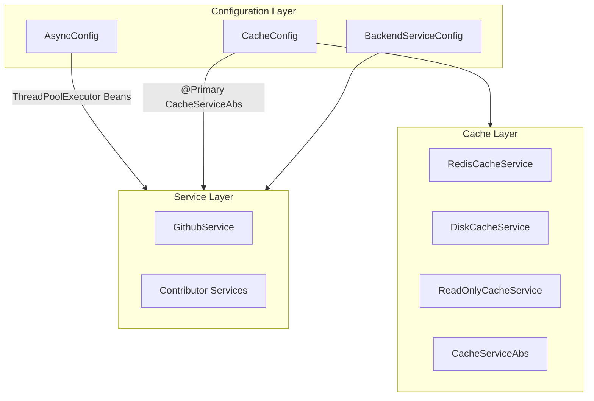
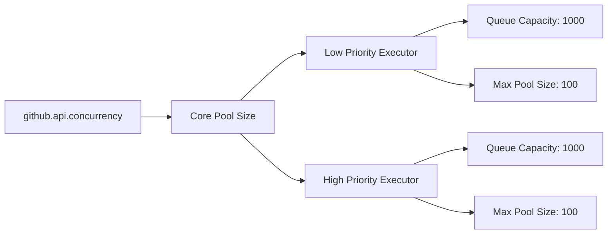
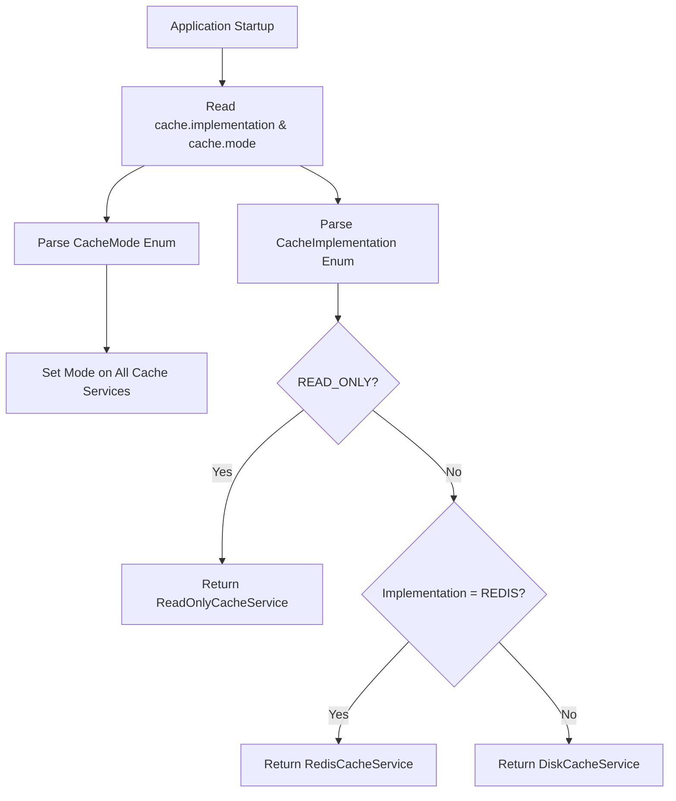
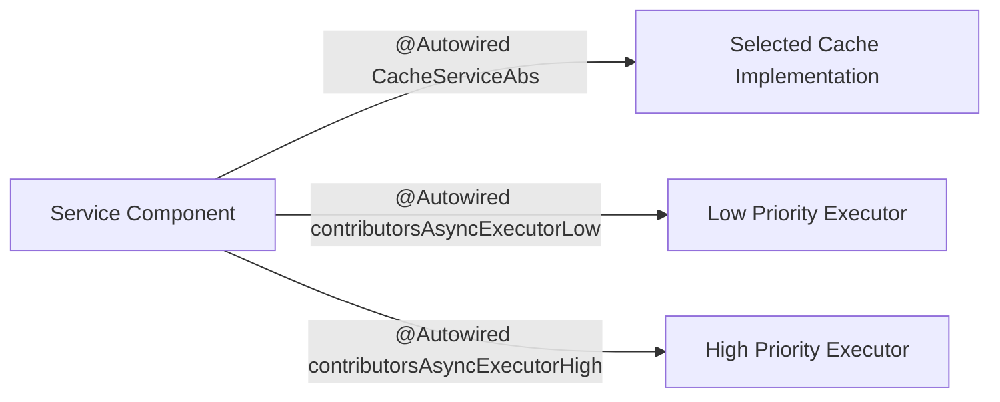

# Configuration Layer

The **Configuration Layer** centralizes all Spring Boot configuration for the backend service of Major League GitHub. It defines how the application initializes asynchronous execution, selects and configures the caching strategy, and activates service-specific behavior using Spring profiles.

This layer acts as the wiring boundary between infrastructure components (executors, cache implementations, environment properties) and higher-level services such as the GitHub integration, contributor services, and controllers.

---

## Responsibilities

The Configuration Layer is responsible for:

- Defining asynchronous execution infrastructure for GitHub API calls
- Selecting and configuring the active cache implementation
- Applying environment-specific configuration using Spring profiles
- Exposing primary beans that are injected across services
- Managing graceful shutdown of background executors

---

## High-Level Architecture



The Configuration Layer wires together infrastructure components and exposes them as injectable Spring beans to the Service Layer.

For detailed cache implementation behavior, see the [Cache Layer](../cache_layer/cache_layer.md).

---

# Core Components

## AsyncConfig

**Purpose:** Configures thread pools for concurrent GitHub API processing.

### Key Features

- Defines two named `ThreadPoolExecutor` beans:
  - `contributorsAsyncExecutorLow`
  - `contributorsAsyncExecutorHigh`
- Concurrency controlled by property:

```text
github.api.concurrency (default: 10)
```

- Graceful shutdown using `@PreDestroy`
- Waits for tasks to complete before forcing termination

### Executor Configuration



### Lifecycle Management

During application shutdown:

1. `@PreDestroy` triggers `shutdown()`
2. Each executor:
   - Stops accepting new tasks
   - Waits up to 10 seconds
   - Forces shutdown if necessary
3. Logs shutdown progress

This prevents orphaned GitHub API calls and ensures graceful termination in Kubernetes environments.

---

## CacheConfig

**Purpose:** Selects and configures the active cache strategy.

This configuration determines:

- Which cache implementation is active (Redis or Disk)
- Whether the cache operates in read-only, read-write, or force-update mode
- Which implementation is exposed as the primary `CacheServiceAbs` bean

### Configuration Properties

```text
cache.implementation (redis | disk)
cache.mode (read-only | read-write | force-update)
```

Defaults:

- `cache.implementation = redis`
- `cache.mode = read-write`

### Cache Mode Enum

| Mode | Behavior |
|------|----------|
| read-only | Reads from cache only; no updates |
| read-write | Reads and writes to cache |
| force-update | Forces refresh even if cache exists |

### Implementation Selection Flow



### Bean Exposure

```java
@Bean
@Primary
public CacheServiceAbs cacheService(...)
```

Because the bean is marked `@Primary`, any service injecting `CacheServiceAbs` automatically receives the selected implementation without needing to know which one is active.

This ensures clean separation between business logic and infrastructure.

---

## BackendServiceConfig

**Purpose:** Activates backend-specific configuration.

### Key Annotations

```java
@Configuration
@Profile("backend-service")
@EnableWebMvc
```

### Behavior

- Only active when the `backend-service` Spring profile is enabled
- Enables full Spring MVC configuration
- Allows separation from other runtime modes (e.g., cache updater service)

This supports a microservice-style deployment model where different services share code but activate different configurations.

---

# Interaction with Other Layers

## With Cache Layer

The Configuration Layer selects and initializes:

- `RedisCacheService`
- `DiskCacheService`
- `ReadOnlyCacheService`

It sets the `CacheMode` on all implementations before exposing the selected one as primary.

See the [Cache Layer](../cache_layer/cache_layer.md) for detailed implementation behavior.

---

## With Service Layer

Services such as:

- GitHub integration services
- Contributor ranking services
- Pre-caching services

Depend on:

- `CacheServiceAbs`
- Named `ThreadPoolExecutor` beans



This design ensures:

- Infrastructure can change without modifying service code
- Cache strategy can be swapped via configuration
- Concurrency can be tuned per environment

---

# Environment-Driven Behavior

The Configuration Layer is fully environment-driven.

Examples:

### High-Performance Production

```text
cache.implementation=redis
cache.mode=read-write
github.api.concurrency=25
spring.profiles.active=backend-service
```

### Local Development

```text
cache.implementation=disk
cache.mode=read-write
github.api.concurrency=5
spring.profiles.active=backend-service
```

### Read-Only Mode (Safe Diagnostics)

```text
cache.implementation=redis
cache.mode=read-only
```

This flexibility allows the same codebase to operate efficiently across development, staging, and production.

---

# Design Principles

The Configuration Layer follows these architectural principles:

### 1. Separation of Concerns

Business services do not know which cache implementation is active.

### 2. Environment-Driven Infrastructure

Infrastructure decisions are property-based rather than code-based.

### 3. Graceful Resource Management

Executors are shut down cleanly to avoid resource leaks.

### 4. Extensibility

Adding a new cache implementation requires:

1. Implementing `CacheServiceAbs`
2. Extending `CacheImplementation` enum
3. Updating the selection logic in `CacheConfig`

No service-layer changes required.

---

# Summary

The **Configuration Layer** is the infrastructure orchestration hub of the backend service. It:

- Manages concurrency for GitHub API processing
- Selects and configures the active caching strategy
- Applies profile-specific runtime behavior
- Exposes primary beans for dependency injection
- Ensures graceful application shutdown

By centralizing infrastructure decisions and exposing clean abstractions, it keeps the rest of the system modular, testable, and environment-flexible.