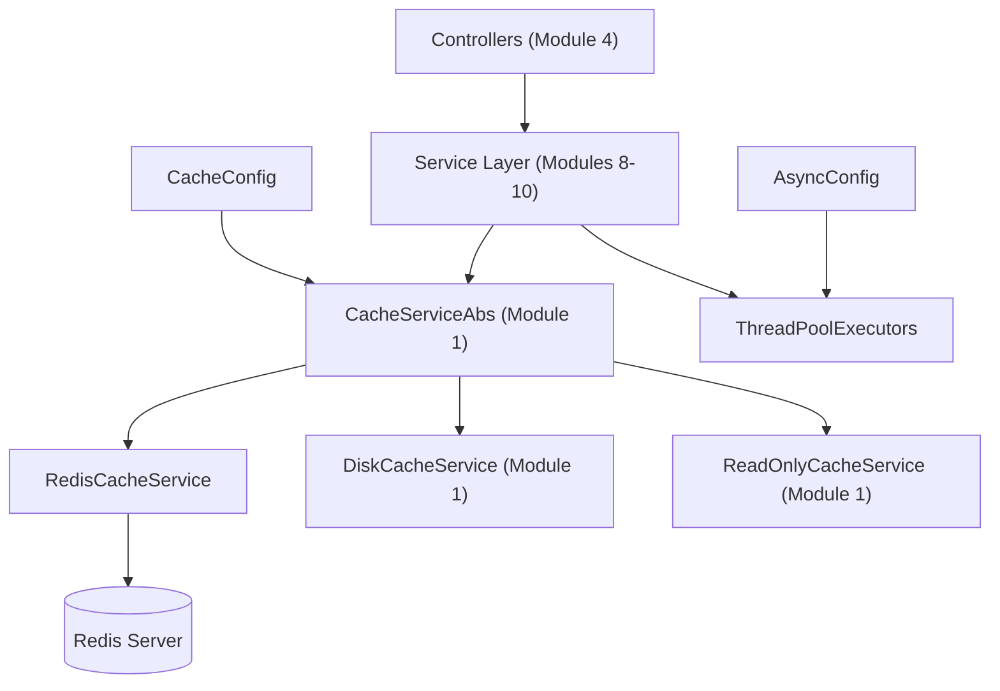
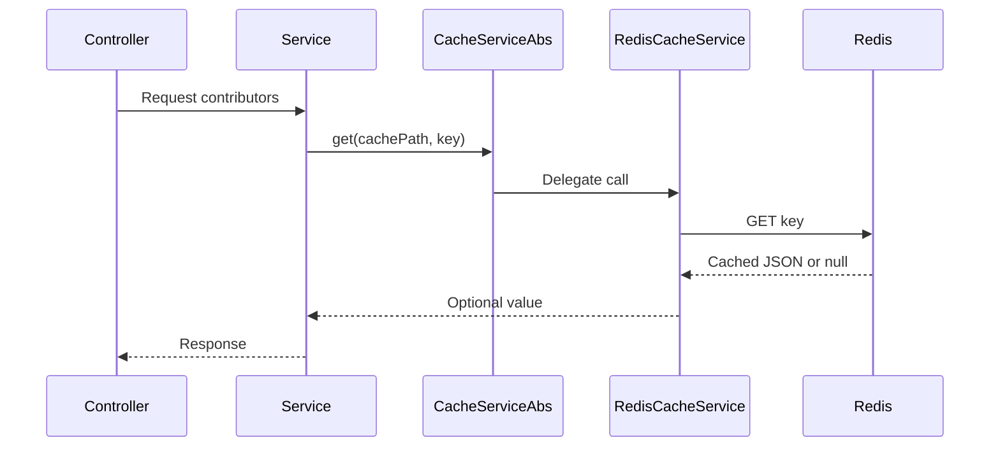
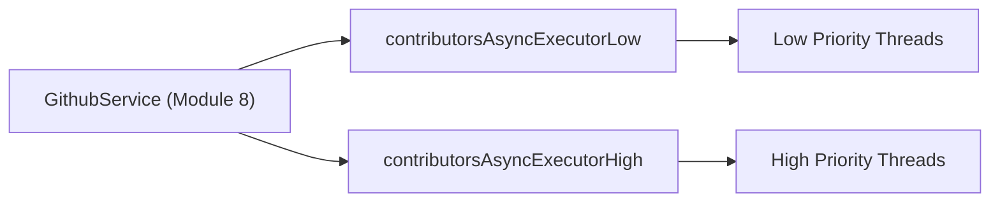

# Module 2

Module 2 provides the **distributed caching and core runtime configuration layer** for the Major League GitHub backend service. It is responsible for:

- Redis-backed caching infrastructure
- Cache mode and implementation selection
- Asynchronous execution configuration for GitHub API workloads
- Backend-specific Spring configuration

This module acts as the infrastructure backbone that supports higher-level services (see other modules in the module tree) by ensuring scalable caching, controlled concurrency, and environment-aware configuration.

---

## Architectural Overview

### Key Responsibilities

1. **Distributed Cache Implementation** via Redis.
2. **Cache Strategy Selection** (read-only, read-write, force-update).
3. **Thread Pool Management** for GitHub API concurrency.
4. **Spring Profile-Based Backend Configuration**.

---

## Sub-Modules

Module 2 can be logically divided into two major areas:

### 1. Cache Layer

Responsible for Redis-backed caching and expiration metadata handling.

- [Cache Layer](module_2/cache_layer/cache_layer.md)
  - See detailed implementation in `module_2/cache_layer/cache_layer.md`

Core components:
- `RedisCacheService`
- `Expiration`

---

### 2. Configuration Layer

Defines Spring configuration for caching behavior, async execution, and backend profile activation.

- [Configuration Layer](module_2/configuration_layer/configuration_layer.md)
  - See detailed configuration documentation in `module_2/configuration_layer/configuration_layer.md`

Core components:
- `AsyncConfig`
- `BackendServiceConfig`
- `CacheConfig`

---

## How Module 2 Fits Into the System

- **Module 1** defines the abstract cache contract (`CacheServiceAbs`).
- **Module 2** provides the Redis implementation and runtime configuration.
- **Service modules (8–10)** rely on the configured cache and async executors.
- **Controller modules (4)** indirectly benefit from caching and concurrency control.

In production deployments, Redis is typically the default cache implementation, enabling horizontal scalability and shared caching across backend instances.

---

## Runtime Flow (Cache Access Example)

---

## Concurrency Model

The concurrency level is configurable via the `github.api.concurrency` property and controls the core pool size of both thread pools.

---

## Configuration Properties

| Property | Default | Description |
|----------|----------|------------|
| `cache.implementation` | `redis` | Selects Redis or disk-based cache |
| `cache.mode` | `read-write` | Controls read/write behavior |
| `github.api.concurrency` | `10` | Core thread pool size for GitHub calls |

---

<!-- MODULE_2_FINALIZE_MARKER -->
