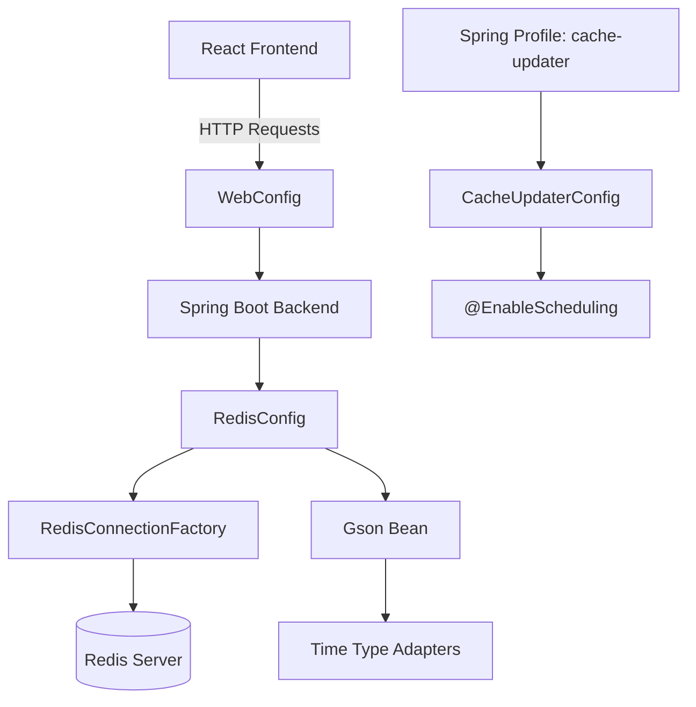
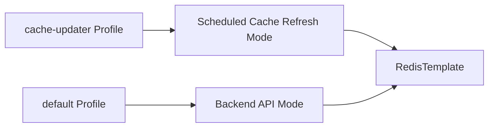

# Module 3

## Overview

Module 3 contains the **infrastructure configuration layer** of the Major League GitHub backend. It centralizes Spring Boot configuration related to:

- Profile-specific behavior (Cache Updater service)
- Redis connectivity and serialization
- JSON serialization for time-based types
- Global web configuration (CORS)

This module ensures that the backend services can:

- Connect to Redis reliably
- Serialize and deserialize Java time objects consistently
- Enable scheduled jobs in the cache-updater profile
- Safely expose APIs to the React frontend through controlled CORS rules

Module 3 primarily supports runtime behavior for service modules such as the business logic in Module 8–10 and the caching infrastructure defined in Module 2.

---

## Architectural Role

Module 3 sits at the configuration boundary between Spring Boot, Redis, scheduling infrastructure, and the HTTP layer.



### Responsibilities at a Glance

| Component | Responsibility |
|------------|----------------|
| CacheUpdaterConfig | Enables scheduled jobs under the cache-updater profile |
| RedisConfig | Configures Redis connection, template, and JSON serialization |
| LocalDateTimeAdapter | Custom Gson adapter for LocalDateTime |
| InstantTypeAdapter | Custom Gson adapter for Instant |
| WebConfig | Global CORS configuration |

---

## Component Breakdown

### 1. CacheUpdaterConfig

**Class:** `CacheUpdaterConfig`

```java
@Configuration
@Profile("cache-updater")
@EnableScheduling
public class CacheUpdaterConfig extends WebMvcAutoConfiguration
```

### Purpose

This configuration class activates **scheduled tasks** when the application runs with the `cache-updater` profile.

### Key Characteristics

- Annotated with `@Profile("cache-updater")`
- Annotated with `@EnableScheduling`
- Extends `WebMvcAutoConfiguration`

### Behavior

When the backend starts with:

```bash
-Dspring.profiles.active=cache-updater
```

Spring:

- Registers scheduled tasks
- Enables periodic cache refresh jobs
- Activates the cache-updater-specific runtime mode

This configuration supports services such as pre-caching and GitHub data refresh operations defined in service modules.

---

### 2. RedisConfig

**Class:** `RedisConfig`

This class configures Redis connectivity and JSON serialization.

#### Redis Connection Factory

```java
@Bean
public RedisConnectionFactory redisConnectionFactory()
```

- Uses `RedisStandaloneConfiguration`
- Configurable via:
  - `spring.redis.host`
  - `spring.redis.port`
- Uses Lettuce as the Redis client

#### RedisTemplate Configuration

```java
@Bean
public RedisTemplate<String, Object> redisTemplate(...)
```

Configuration details:

- Key serializer: `StringRedisSerializer`
- Value serializer: `StringRedisSerializer`
- Hash key/value serializer: `StringRedisSerializer`
- Transaction support enabled

This ensures consistent string-based key/value storage across the system.

---

### 3. Gson Bean and Time Serialization

RedisConfig also defines a centralized Gson bean:

```java
@Bean
public Gson gson()
```

It registers two custom type adapters:

- `LocalDateTimeAdapter`
- `InstantTypeAdapter`

These ensure that Java time objects are serialized into ISO-8601 compliant strings and parsed correctly when retrieved.

---

### 4. LocalDateTimeAdapter

**Class:** `LocalDateTimeAdapter`

Implements:

- `JsonSerializer<LocalDateTime>`
- `JsonDeserializer<LocalDateTime>`

### Serialization Strategy

```text
LocalDateTime <-> ISO_LOCAL_DATE_TIME string
```

Example format:

```text
2026-07-24T14:30:00
```

This ensures consistent formatting when storing time-based metadata in Redis or returning JSON responses.

---

### 5. InstantTypeAdapter

**Class:** `InstantTypeAdapter`

A private static class inside `RedisConfig`.

Implements:

- `TypeAdapter<Instant>`

### Behavior

- Serializes `Instant` using `Instant.toString()`
- Deserializes using `Instant.parse()`
- Safely handles null values

This avoids default Gson behavior inconsistencies and guarantees UTC-safe serialization.

---

### 6. WebConfig

**Class:** `WebConfig`

Implements:

- `WebMvcConfigurer`

### CORS Configuration

```java
@Override
public void addCorsMappings(CorsRegistry registry)
```

#### Allowed Origins

- `http://localhost:8450`
- `http://localhost:3000`
- `https://www.mlg.soccer`
- `http://www.mlg.soccer`

#### Allowed Methods

- GET
- POST
- PUT
- DELETE
- OPTIONS

#### Additional Settings

- `allowedHeaders("*")`
- `exposedHeaders("Access-Control-Allow-Origin")`
- `allowCredentials(true)`
- `maxAge(3600)`

### Architectural Impact

This configuration:

- Enables secure frontend-backend communication
- Supports local development
- Supports production deployment behind ingress
- Allows credential-based requests (cookies, auth headers)

---

## Runtime Profiles and Behavior



### Default Profile

- Acts as the standard API backend
- Exposes REST endpoints
- Uses Redis for caching

### Cache-Updater Profile

- Enables scheduled tasks
- Refreshes contributor and GitHub data
- Writes updated results into Redis

This separation allows horizontal scaling:

- One deployment for API traffic
- One deployment dedicated to periodic cache refresh

---

## Interaction with Other Modules

Module 3 provides foundational configuration used by:

- Caching infrastructure in Module 2
- Service layer in Module 8–10
- Controllers in Module 4

It does not contain business logic. Instead, it enables:

- Reliable data caching
- Consistent time serialization
- Controlled cross-origin access
- Profile-based execution modes

---

## Summary

Module 3 is the **configuration backbone** of the backend service. It:

- Enables profile-driven behavior
- Configures Redis connectivity
- Standardizes JSON time serialization
- Defines secure CORS rules
- Activates scheduling for cache refresh jobs

By isolating infrastructure concerns into this module, the rest of the system remains focused on business logic, GraphQL integration, caching strategies, and frontend integration.
