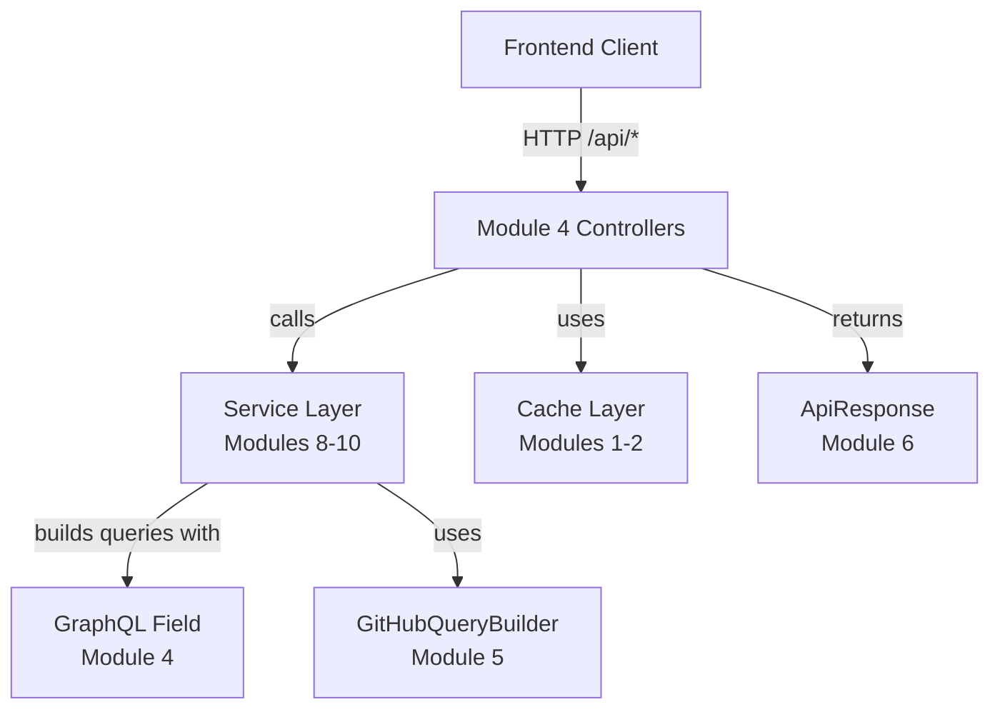
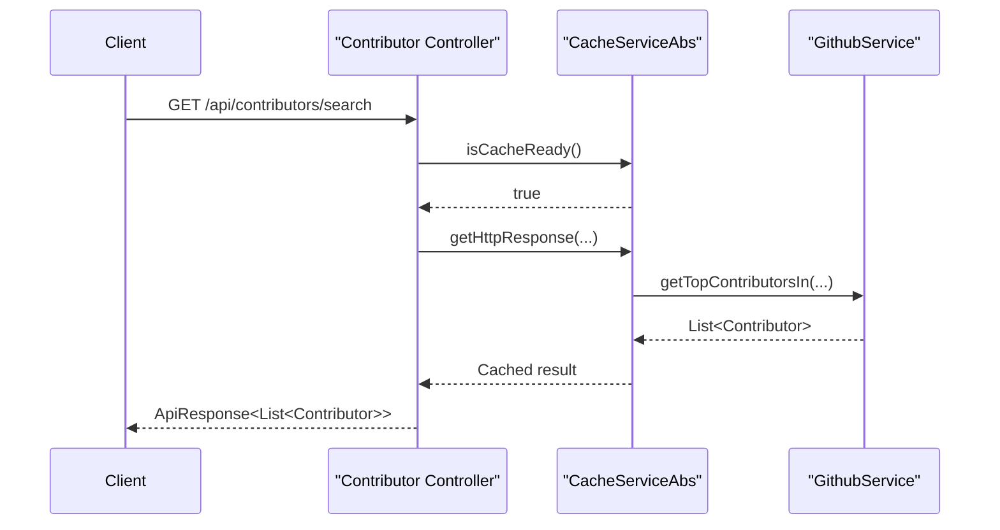

# Module 4

## Overview

Module 4 represents the **API Layer** of the Major League GitHub backend. It exposes REST endpoints that power the frontend experience, including:

- Autocomplete search for geographic and domain entities
- Contributor search and CSV export
- Entity lookup by ID
- Hiring and job-related endpoints
- A lightweight GraphQL field builder utility

This module acts as the bridge between:

- The **Service Layer** (see Module 8, Module 9, and Module 10)
- The **Caching Layer** (see Module 1 and Module 2)
- The **Model Layer** (see Module 6 and Module 7)
- The **GraphQL Query Builder** (see Module 5)

It is implemented using Spring Boot REST controllers and follows a clean separation of concerns: controllers orchestrate requests, delegate to services, and wrap responses in standardized API structures.

---

## Architectural Position



### Responsibilities

Module 4 is responsible for:

- Defining public REST endpoints under `/api/*`
- Validating and logging request parameters
- Coordinating cache-aware data retrieval
- Formatting standardized responses
- Handling export use cases (CSV generation)
- Providing a reusable GraphQL field abstraction

It does **not**:

- Contain business logic (delegated to services)
- Manage cache implementation details (handled in Modules 1–2)
- Construct full GitHub queries (handled in Module 5)

---

## Sub-Modules

Module 4 consists of the following components:

- [Autocomplete Controller](module_4/autocomplete_controller/autocomplete_controller.md)
- [Contributor Controller](module_4/contributor_controller/contributor_controller.md)
- [Entity Controller](module_4/entity_controller/entity_controller.md)
- [Hiring Controller](module_4/hiring_controller/hiring_controller.md)
- [GraphQL Field](module_4/graphql_field/graphql_field.md)

Each controller focuses on a specific domain boundary, ensuring the API surface remains organized and predictable.

---

## Request Flow Example

The following diagram illustrates a typical contributor search request:



This demonstrates:

- Cache-first retrieval strategy
- Lazy data fetch via lambda callback
- Standardized response wrapping

---

## API Design Principles

Module 4 follows these consistent API patterns:

### 1. RESTful Routing

All endpoints are grouped by domain:

```text
/api/autocomplete/*
/api/contributors/*
/api/entities/*
/api/hiring/*
```

### 2. Standardized Response Wrapper

Most endpoints return:

```text
ApiResponse<T>
```

This ensures:

- Consistent `status`
- Human-readable `message`
- Strongly typed `data`

### 3. Cache Awareness

Before executing expensive GitHub queries, the system:

- Verifies cache readiness
- Delegates to `CacheServiceAbs`
- Falls back gracefully on failure

### 4. Logging and Observability

All endpoints log:

- Input parameters
- Missing entities
- Cache state issues

This ensures traceability for production debugging.

---

## Interaction with Other Modules

| Concern | Responsible Module |
|----------|-------------------|
| Cache abstraction | Module 1 |
| Redis cache + expiration | Module 2 |
| Configuration (async, redis, web) | Module 3 |
| GitHub query construction | Module 5 |
| Domain models (Contributor, City, etc.) | Module 6 & Module 7 |
| Service logic (CityService, GithubService, etc.) | Module 8–10 |

Module 4 is intentionally thin and orchestration-focused.

---

## Design Strengths

- ✅ Clear separation of controller and service layers
- ✅ Cache-first design for performance
- ✅ Export capability for business use cases
- ✅ Strong typing across models
- ✅ Reusable GraphQL field abstraction

---

## Summary

Module 4 is the **public-facing API layer** of the backend. It:

- Exposes search, lookup, export, and hiring endpoints
- Coordinates caching and service interactions
- Wraps responses consistently
- Provides a fluent GraphQL field abstraction

It forms the critical boundary between the frontend application and the backend service ecosystem while remaining lightweight, maintainable, and extensible.
