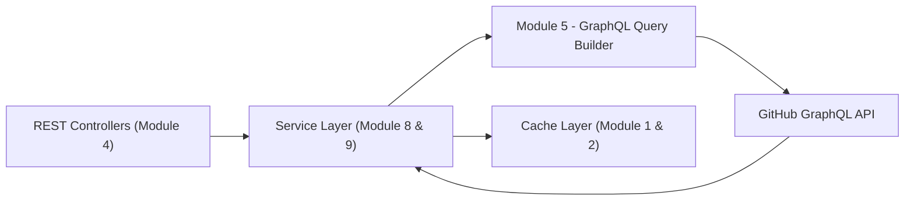
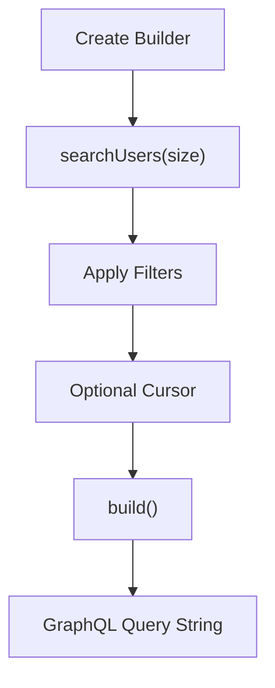
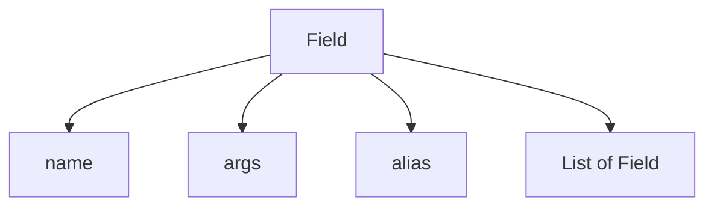
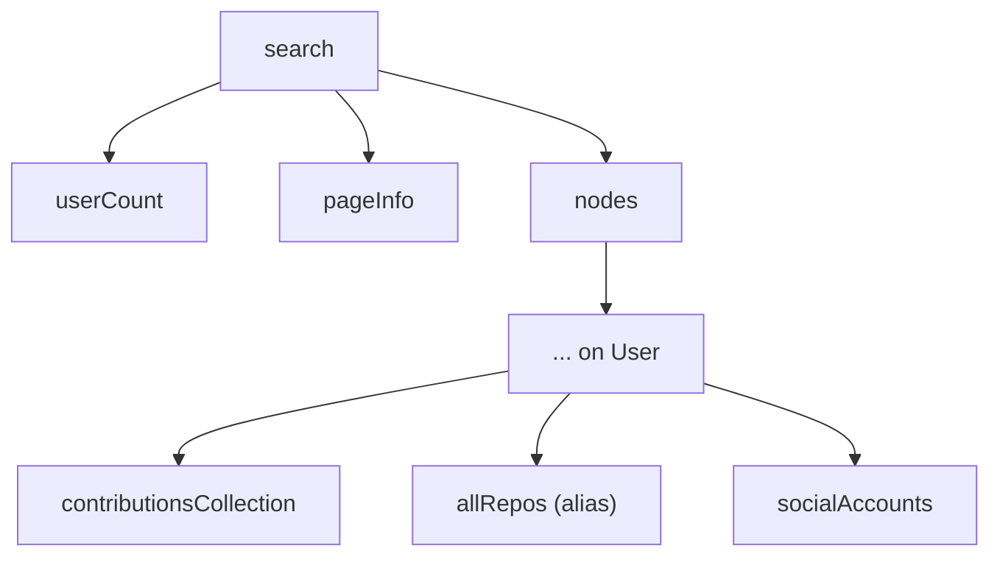
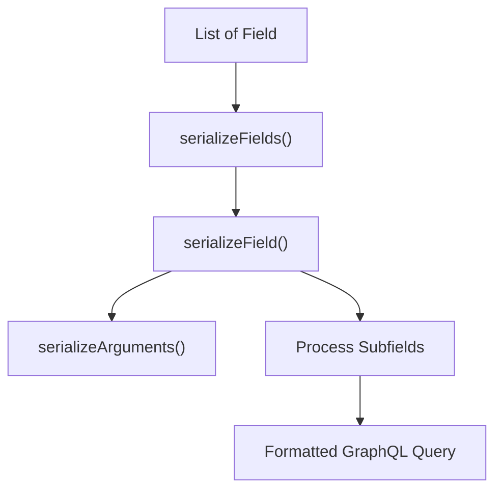
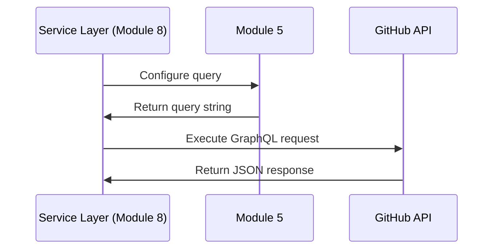

# Module 5

## Overview

Module 5 encapsulates the **GraphQL query construction layer** of the Major League GitHub backend. It is responsible for dynamically building and serializing GitHub GraphQL queries used to retrieve contributor, repository, and social metadata from the GitHub API.

This module provides:

- A fluent **query builder API** for constructing complex GitHub search queries
- A composable **field abstraction** for nested GraphQL structures
- A **search-specific extension layer** for applying filters and sorting
- A **query serializer** for converting structured fields into formatted GraphQL query strings

Module 5 acts as the bridge between:

- The **service layer** (for example, [Module 8](../module_8/module_8.md)) which orchestrates GitHub requests
- The **rate limiting layer** (also in [Module 8](../module_8/module_8.md)) which manages token usage
- The external **GitHub GraphQL API**

It does not perform HTTP calls directly. Instead, it produces fully-formed GraphQL query strings that other services execute.

---

## Architectural Context

Within the backend architecture, Module 5 sits between domain services and GitHub’s GraphQL endpoint.



### Responsibilities Separation

| Layer | Responsibility |
|--------|----------------|
| Module 4 | REST endpoints and request handling |
| Module 8/9 | Business logic, GitHub orchestration |
| **Module 5** | GraphQL query construction and serialization |
| Module 1/2 | Caching of API responses |

Module 5 ensures the rest of the backend remains **decoupled from raw GraphQL string construction**.

---

## Core Components

Module 5 contains the following core components:

- `GitHubQueryBuilder`
- `GitHubQueryBuilder.Field`
- `GitHubQueryBuilder.SearchField`
- `SearchField` (standalone extension)
- `QuerySerializer`

These components together form a composable GraphQL DSL (Domain-Specific Language).

---

# GitHubQueryBuilder

## Purpose

`GitHubQueryBuilder` provides a fluent API to construct GitHub GraphQL search queries, specifically optimized for **user search queries**.

It pre-configures:

- Search type (e.g., USER)
- Pagination
- Sorting by repositories, stars, followers
- Default nested fields for user metadata
- Contributions and repository statistics

---

## High-Level Flow



---

## Fluent Builder Example (Conceptual)

```java
String query = new GitHubQueryBuilder()
    .searchUsers(25)
    .location("California")
    .language("Java")
    .cursor("abc123")
    .build();
```

This produces a query equivalent to:

```text
query {
  search(type: USER, first: 25, query: "location:\"California\" language:Java sort:repositories-desc sort:stars-desc sort:followers-desc") {
    ...
  }
}
```

---

# Field Abstraction

## GitHubQueryBuilder.Field

`Field` is the foundational building block representing a GraphQL field node.

### Capabilities

- Field name
- Optional alias
- Optional arguments
- Nested subfields
- Recursive `build()` support

### Structural Model



Each field can contain nested subfields, enabling deep GraphQL query trees such as:

- `search`
  - `nodes`
    - `... on User`
      - `repositories`
        - `nodes`

This recursive design enables arbitrarily deep GraphQL queries without hardcoding query strings.

---

# SearchField (Nested in GitHubQueryBuilder)

## Purpose

The nested `SearchField` class specializes the base `Field` class for GitHub’s `search` query.

It adds:

- Search type configuration
- Filter composition
- Sorting logic
- Query argument management
- Default nested user fields

---

## Default Query Structure

When instantiated, it automatically configures:

- `userCount`
- `pageInfo` with pagination fields
- `nodes` with `... on User`
- Social accounts
- Contributions calendar
- Repository statistics
- Primary language metadata



This ensures consistent and complete contributor data retrieval across the system.

---

## Query Filter Composition

Search filters are built incrementally:

- `location:"City"`
- `language:Java`
- `sort:repositories-desc`

The builder safely escapes embedded quotes before injecting them into the `query` argument.

---

# Standalone SearchField

A second `SearchField` class exists as a separate implementation extending `Field`.

## Key Characteristics

- Maintains a `StringBuilder` for query segments
- Appends query parts safely
- Overrides `addArg` to preserve fluent typing

This variant supports alternative query construction patterns where arguments are managed as a key-value map instead of a raw string.

It reflects an evolution toward more structured argument handling compared to the nested implementation.

---

# QuerySerializer

## Purpose

`QuerySerializer` converts a structured list of `Field` objects into a formatted GraphQL query string with indentation.

Unlike `Field.build()`, which generates compact inline output, `QuerySerializer`:

- Adds indentation
- Formats nested structures cleanly
- Serializes argument maps
- Produces readable multi-line GraphQL queries

---

## Serialization Flow



---

## Responsibilities

| Method | Responsibility |
|--------|----------------|
| `serialize()` | Entry point |
| `serializeFields()` | Wraps query block |
| `serializeField()` | Recursively serializes nodes |
| `serializeArguments()` | Formats argument maps |

---

# Interaction With Other Modules

## With Module 8 (GitHubService)

Module 8’s `GithubService` constructs queries using `GitHubQueryBuilder`, executes them against GitHub, and maps results into domain models.

Relationship:



## With Module 6 and 7 (Domain Models)

Data retrieved via queries is mapped into domain objects such as:

- Contributor
- Language
- Region
- SoccerTeam

Module 5 is strictly responsible for query generation, not object mapping.

## With Module 1 and 2 (Caching)

Once a query is executed, the result may be cached. Module 5 ensures consistent query structure so cache keys remain deterministic.

---

# Design Principles

### 1. Fluent API Design
Enables expressive and readable query construction.

### 2. Recursive Composition
Each field can contain nested fields, mirroring GraphQL’s hierarchical model.

### 3. Separation of Concerns
- Query construction → Module 5
- HTTP execution → Service layer
- Caching → Cache modules
- Domain mapping → Model modules

### 4. Extensibility
New fields or filters can be added without modifying service logic.

---

# Summary

Module 5 is the **GraphQL construction engine** of the Major League GitHub backend.

It:

- Abstracts complex GitHub GraphQL syntax
- Provides composable field structures
- Encapsulates filtering and sorting logic
- Ensures consistent query generation
- Keeps service logic clean and declarative

By isolating GraphQL query logic into a dedicated module, the system achieves:

- Maintainability
- Reusability
- Reduced duplication
- Easier evolution of GitHub data requirements

Module 5 plays a foundational role in enabling dynamic contributor ranking, filtering by language and location, and powering the leaderboard functionality across the platform.
