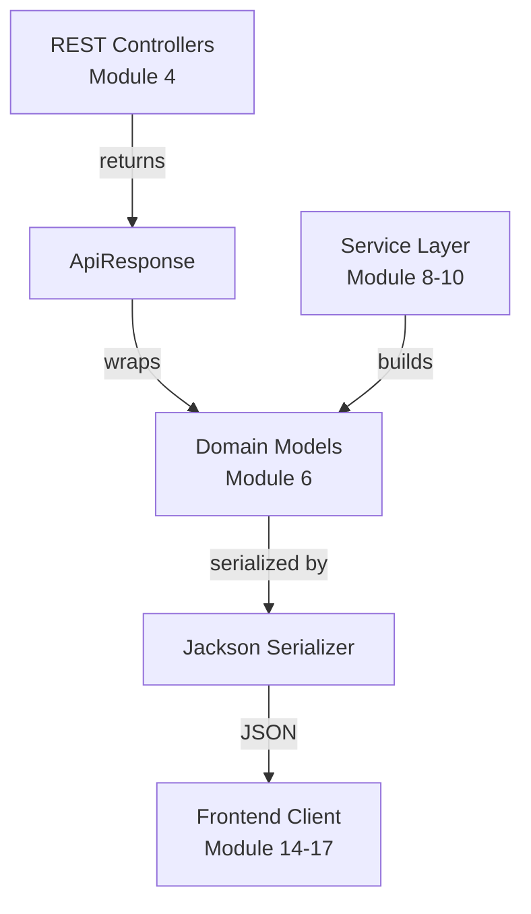
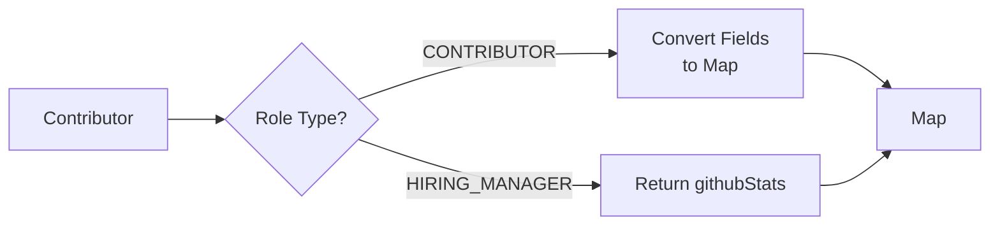
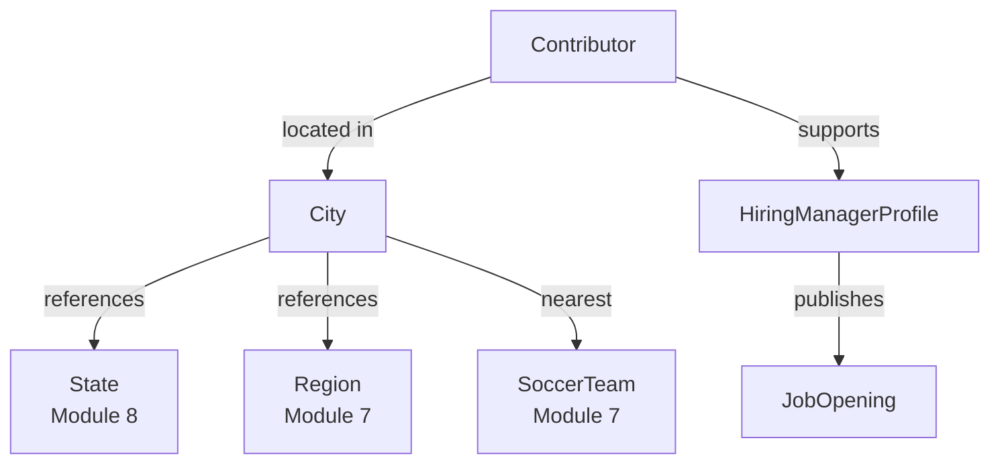

# Module 6

## Overview

Module 6 defines the **core domain models** used by the Major League GitHub backend to represent API responses, contributors, hiring managers, cities, and job openings. These models form the backbone of the data layer exposed through the REST controllers in [Module 4](../module_4/module_4.md) and consumed by service logic in [Module 9](../module_9/module_9.md).

Unlike service or configuration modules, Module 6 focuses purely on **data representation**. It standardizes how entities are structured, serialized, and returned to clients.

The primary responsibilities of Module 6 are:

- Define consistent API response envelopes
- Model contributors and hiring managers
- Represent geographic context (City)
- Represent hiring-related entities (HiringManagerProfile, JobOpening)
- Bridge backend models with frontend API types (see Module 14–17)

---

## Architectural Role

Module 6 sits at the center of backend data flow. Controllers assemble these models, services populate them, and serializers convert them into JSON.



Module 6 does not contain business logic or persistence logic. Instead, it defines the **contract** between backend and frontend.

---

# Core Components

## 1. ApiResponse

**Component:**  
`major-league-github.backend.src.main.java.cx.flamingo.analysis.model.ApiResponse.ApiResponse`

### Purpose

Provides a consistent wrapper for all API responses returned by controllers.

### Structure

- `status` — success or error
- `message` — optional human-readable message
- `data` — generic payload of type `T`

### Factory Methods

- `success(data)`
- `success(data, message)`
- `error(message)`

### Design Rationale

Using a generic wrapper:

- Standardizes response shape
- Simplifies frontend parsing
- Enables consistent error handling
- Avoids ambiguity in empty responses

Example JSON structure:

```json
{
  "status": "success",
  "message": "Contributors retrieved",
  "data": [ ... ]
}
```

---

## 2. Contributor

**Component:**  
`major-league-github.backend.src.main.java.cx.flamingo.analysis.model.Contributor.Contributor`

### Purpose

Represents both:

- GitHub contributors (ranked players)
- Hiring managers (recruiters using the platform)

This unified model supports leaderboard views and hiring workflows.

### Role Enum

```text
CONTRIBUTOR
HIRING_MANAGER
```

### Common Fields

- `login`
- `name`
- `avatarUrl`
- `url`
- `email`
- `role` (job title)
- `bio`
- `type` (enum)
- `socialLinks`
- `cityId`
- `nearestTeamId`
- `city` (reference object)
- `nearestTeam` (reference object)
- `lastActive`

### Stats Modeling Strategy

The model supports **two stat representations**:

1. Individual fields (for contributors):
   - `totalCommits`
   - `javaRepos`
   - `starsReceived`
   - `forksReceived`
   - `starsGiven`
   - `forksGiven`
   - `score`

2. Map-based representation (for hiring managers):
   - `githubStats`

### Dynamic Getter Logic

`getGithubStats()` dynamically adapts:

- If type = CONTRIBUTOR → converts individual fields into a map
- Otherwise → returns stored map

This design ensures:

- Consistent frontend contract
- Flexible internal storage
- Backward compatibility



---

## 3. City

**Component:**  
`major-league-github.backend.src.main.java.cx.flamingo.analysis.model.City.City`

### Purpose

Represents geographic context for contributors and hiring managers.

### Core Fields

- `id`
- `name`
- `stateId`
- `population`
- `latitude`
- `longitude`
- `regionIds`
- `nearestTeamId`

### Reference Objects

City optionally embeds:

- `State`
- `Set<Region>`
- `SoccerTeam`

This allows flexible serialization strategies:

- Lightweight mode (IDs only)
- Expanded mode (embedded objects)

### Serialization Behavior

Annotated with:

```java
@JsonInclude(JsonInclude.Include.NON_NULL)
```

This ensures null fields are excluded from JSON, reducing payload size.

---

## 4. HiringManagerProfile

**Component:**  
`major-league-github.backend.src.main.java.cx.flamingo.analysis.model.HiringManagerProfile.HiringManagerProfile`

### Purpose

Represents a public-facing hiring manager profile.

This model is separate from Contributor to:

- Provide a simplified hiring-focused structure
- Avoid exposing unnecessary contributor-only fields

### Fields

- `name`
- `avatarUrl`
- `role`
- `bio`
- `socialLinks`
- `githubStats`
- `lastActive`

### Relationship with Contributor

In many flows, a Contributor of type HIRING_MANAGER can be transformed into a HiringManagerProfile for display.

---

## 5. JobOpening

**Component:**  
`major-league-github.backend.src.main.java.cx.flamingo.analysis.model.JobOpening.JobOpening`

### Purpose

Represents a job posting associated with a hiring manager.

### Fields

- `id`
- `title`
- `location`
- `url`

### Usage Context

- Returned by hiring endpoints
- Aggregated by HiringService (see Module 9)
- Displayed in frontend hiring views (see Module 16)

---

# Domain Relationships

The models in Module 6 interconnect with other domain modules.



This demonstrates how Module 6 acts as a **composition layer** that binds:

- Geographic models (Module 7 & 8)
- Hiring models (Module 9 & 16)
- Service-layer aggregation logic

---

# Design Patterns Used

## 1. Builder Pattern

All models use Lombok `@Builder` to:

- Improve readability
- Avoid telescoping constructors
- Support immutable-style construction

## 2. Data Annotation

`@Data` generates:

- Getters
- Setters
- equals
- hashCode
- toString

## 3. Generic Response Wrapper

`ApiResponse<T>` demonstrates a generic wrapper pattern for consistent API contracts.

## 4. Conditional Data Transformation

Contributor uses runtime logic in getters to normalize data shape.

---

# How Module 6 Fits into the System

| Layer | Role of Module 6 |
|--------|------------------|
| Controller Layer (Module 4) | Returns ApiResponse containing these models |
| Service Layer (Module 8–10) | Populates and transforms these models |
| Cache Layer (Module 1–3) | Stores serialized versions of these models |
| Frontend (Module 14–17) | Consumes serialized JSON equivalents |

Module 6 ensures that:

- Backend responses remain stable
- Frontend contracts are predictable
- Services can evolve without breaking API shape

---

# Summary

Module 6 defines the **core data contract** of Major League GitHub.

It provides:

- A unified API response structure
- A flexible contributor model supporting multiple roles
- Geographic composition through City
- Hiring-focused entities
- Clean serialization-ready POJOs

By isolating domain models from services and controllers, Module 6 maintains a clean separation of concerns and enables consistent data exchange across the entire platform.
