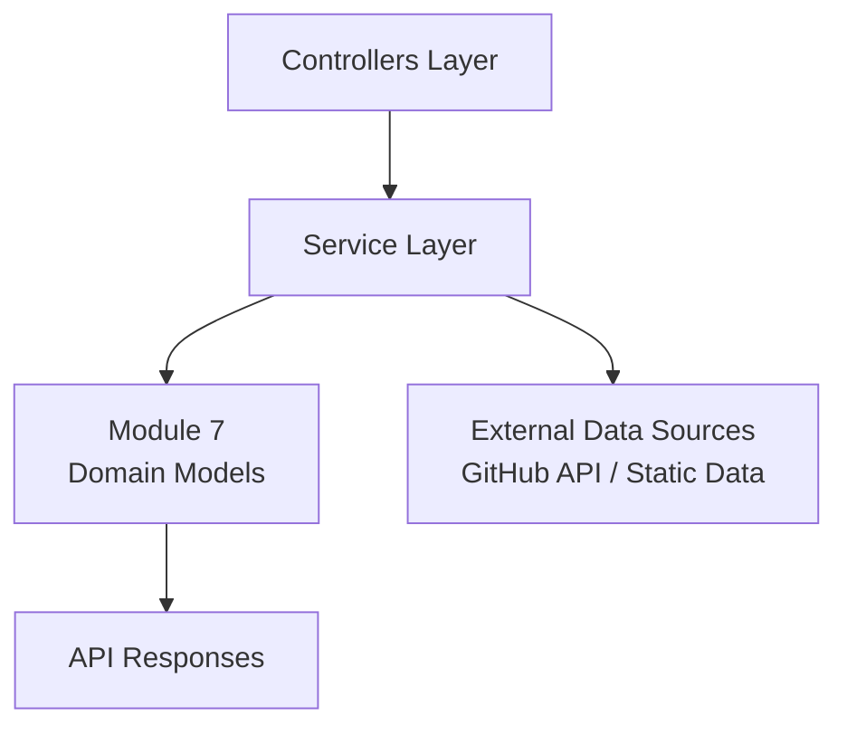
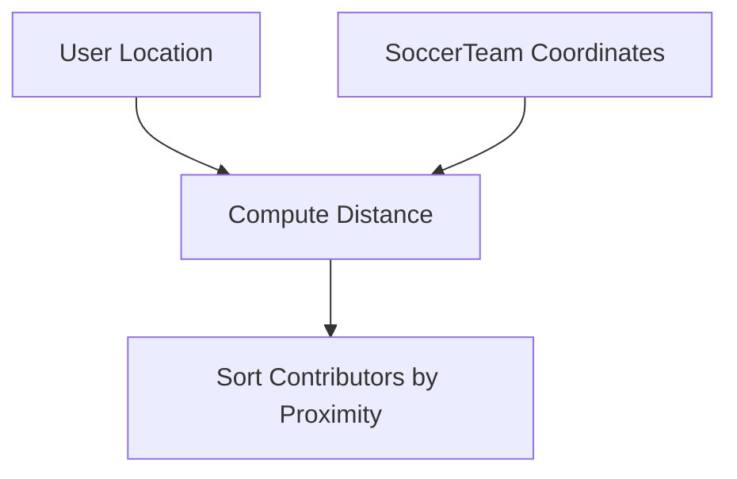
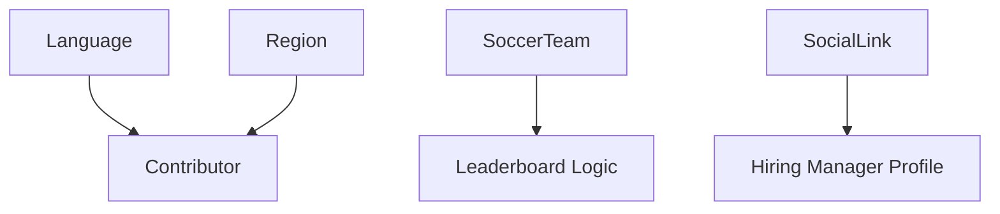

# Module 7

## Overview

**Module 7** defines the core domain models that represent the geographic, language, team, and social identity concepts within the Major League GitHub backend. These models are foundational to how contributors are grouped, filtered, ranked, and displayed across the platform.

At a high level, Module 7 provides:

- Programming language metadata (`Language`)
- Geographic aggregation structures (`Region`, `GeoCoordinates`)
- Soccer team metadata used for proximity-based ranking (`SoccerTeam`)
- External profile references (`SocialLink`)

These models are primarily consumed by service-layer components (for example, region, language, and soccer team services) and are serialized into API responses returned by the backend.

---

## Architectural Context

Module 7 sits in the **model layer** of the backend. It does not contain business logic or persistence logic; instead, it defines immutable or simple data structures used across controllers and services.



### Responsibilities Within the System

- Provide strongly typed domain representations
- Support JSON serialization/deserialization
- Enable geographic and proximity calculations
- Supply metadata for frontend rendering (icons, display names, logos)

---

## Core Components

### 1. Language

**Component:**  
`major-league-github.backend.src.main.java.cx.flamingo.analysis.model.Language.Language`

The `Language` model represents a programming language used for filtering and ranking contributors.

### Structure

```text
Language
 ├── id
 ├── name
 ├── displayName
 └── iconUrl
```

### Key Fields

- `id` – Internal unique identifier (stable reference key).
- `name` – Canonical name used internally (e.g., "java", "typescript").
- `displayName` – Human-readable name shown in the UI.
- `iconUrl` – URL to the language icon used in the frontend.

### Design Notes

- Uses Lombok `@Data` and `@Builder` for concise construction.
- Annotated with `@JsonInclude(JsonInclude.Include.NON_NULL)` to omit null fields from API responses.
- Designed for lightweight transport between backend and frontend.

### Usage Context

- Language filtering in contributor search
- Autocomplete dropdowns
- Leaderboard segmentation

---

### 2. Region and GeoCoordinates

**Components:**  
- `major-league-github.backend.src.main.java.cx.flamingo.analysis.model.Region.Region`  
- `major-league-github.backend.src.main.java.cx.flamingo.analysis.model.Region.GeoCoordinates`

The `Region` model represents a geographic grouping of states and cities, often aligned with soccer regions or logical leaderboard segments.

### Structure

```text
Region
 ├── id
 ├── name
 ├── displayName
 ├── geo (GeoCoordinates)
 ├── stateIds
 ├── states
 └── cities

GeoCoordinates
 ├── latitude
 └── longitude
```

### Key Fields

#### Region

- `id` – Unique region identifier.
- `name` – Internal slug (e.g., "new-england").
- `displayName` – Human-friendly name (e.g., "New England").
- `geo` – Central geographic coordinates of the region.
- `stateIds` – Set of associated state identifiers.
- `states` – Resolved `State` reference objects.
- `cities` – Resolved `City` reference objects.

#### GeoCoordinates

- `latitude` – Geographic latitude.
- `longitude` – Geographic longitude.

### Design Characteristics

- Implemented as immutable value objects using Lombok `@Value`.
- Encourages thread-safe usage and predictable behavior.
- Separates internal IDs from enriched reference objects (`states`, `cities`).

### Geographic Role in the System

Regions support:

- Proximity-based contributor ranking
- Region-specific leaderboards
- Mapping contributors to MLS-style territories


---

### 3. SoccerTeam

**Component:**  
`major-league-github.backend.src.main.java.cx.flamingo.analysis.model.SoccerTeam.SoccerTeam`

The `SoccerTeam` model encapsulates metadata about professional soccer teams used to gamify the contributor leaderboard.

### Structure

```text
SoccerTeam
 ├── id
 ├── name
 ├── city
 ├── state
 ├── latitude
 ├── longitude
 ├── league
 ├── stadium
 ├── stadiumCapacity
 ├── joinedYear
 ├── headCoach
 ├── teamUrl
 ├── wikipediaUrl
 └── logoUrl
```

### Key Capabilities

- Stores precise stadium coordinates (`latitude`, `longitude`).
- Enables distance-based sorting of contributors relative to teams.
- Provides metadata for UI display (logo, coach, stadium info).

### Proximity-Based Ranking Flow



### Design Notes

- Uses Lombok `@Data`, `@Builder`, `@NoArgsConstructor`, and `@AllArgsConstructor`.
- Mutable POJO suitable for deserialization and configuration loading.
- Acts as a hybrid geographic and presentation model.

---

### 4. SocialLink

**Component:**  
`major-league-github.backend.src.main.java.cx.flamingo.analysis.model.SocialLink.SocialLink`

The `SocialLink` model represents external profile references tied to hiring managers or contributors.

### Structure

```text
SocialLink
 ├── platform
 └── url
```

### Key Fields

- `platform` – Name of the platform (e.g., "LinkedIn", "Twitter", "GitHub").
- `url` – Direct link to the external profile.

### Usage Context

- Included in hiring manager profiles.
- Used to render external social/contact icons in the frontend.
- Extensible for additional platforms without schema changes.

---

## Cross-Model Relationships

Module 7 models interact indirectly through higher-level domain entities:



Although `Contributor`, `State`, `City`, and hiring-related models are defined in other modules, Module 7 provides essential geographic and classification structures that those models depend on.

---

## Serialization and Data Integrity

All models in Module 7 are:

- JSON-serializable
- Framework-agnostic (no persistence annotations)
- Designed for clean API exposure

Patterns used:

- Lombok annotations to reduce boilerplate
- Builder pattern for safe construction
- Immutable value objects where appropriate
- Explicit separation between identifiers and reference objects

---

## Design Principles

Module 7 follows these architectural principles:

1. **Separation of Concerns** – Models only represent data, not behavior.
2. **Immutability Where Appropriate** – Regions use value semantics.
3. **Frontend-Oriented Metadata** – Display names, icons, and URLs are embedded for UI rendering.
4. **Geographic Precision** – Latitude/longitude fields support deterministic distance calculations.

---

## Summary

Module 7 provides the structural backbone for:

- Language-based filtering
- Region-based grouping
- Soccer-themed proximity ranking
- Social and hiring profile linking

Without Module 7, the system would lack the geographic, classification, and presentation metadata required to transform raw GitHub contributor data into a sports-styled leaderboard experience.