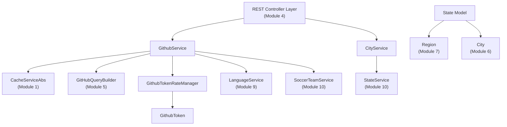
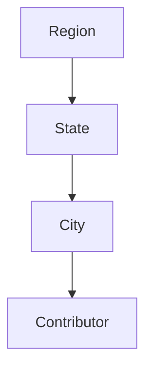
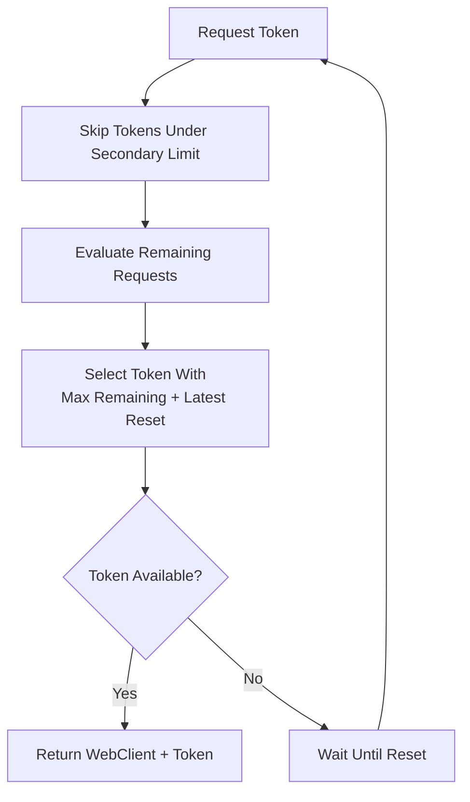
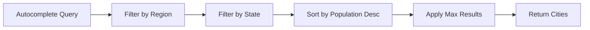
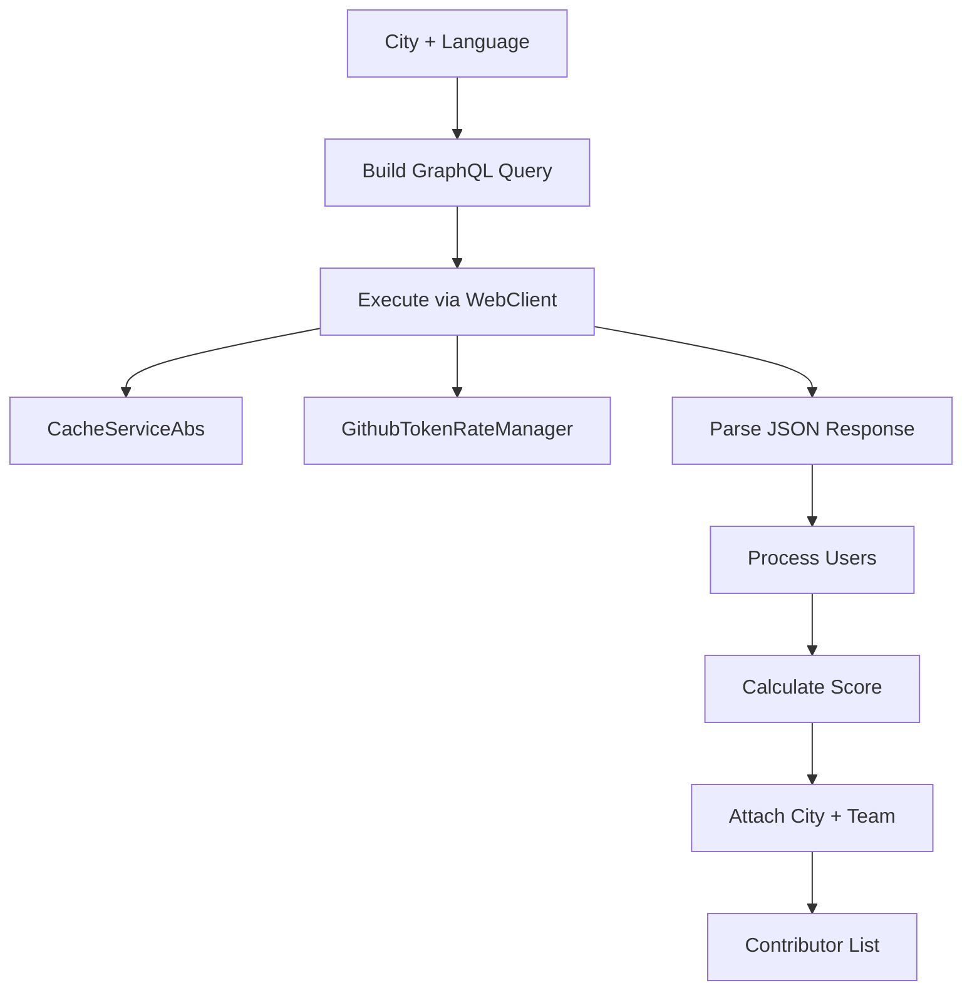
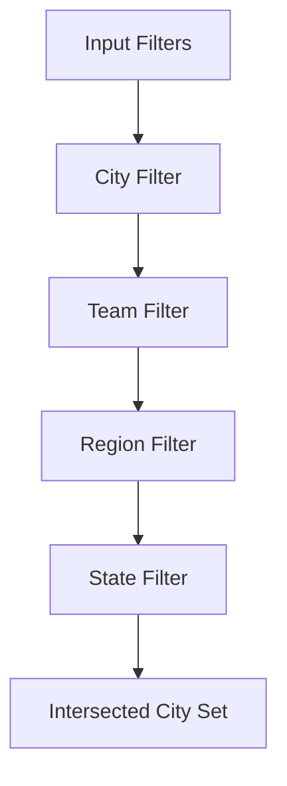

# Module 8

## Overview

**Module 8** is a core backend orchestration layer responsible for:

- Managing U.S. state domain modeling.
- Handling GitHub API rate limits across multiple tokens.
- Fetching, scoring, and enriching GitHub contributor data.
- Loading and filtering cities for geographic-based leaderboard queries.

This module sits at the intersection of:

- Domain models (see [Module 7](module_7.md))
- Service layer orchestration (see [Module 9](module_9.md))
- Caching infrastructure (see [Module 1](module_1.md) and [Module 2](module_2.md))
- GraphQL query construction (see [Module 5](module_5.md))

It is central to transforming raw GitHub GraphQL responses into ranked, location-aware contributor profiles.

---

## Architectural Responsibilities

Module 8 contains five primary components:

- `State` – Domain model for U.S. states
- `GithubToken` – Encapsulates primary and secondary rate limit state
- `GithubTokenRateManager` – Selects optimal token and manages rate limits
- `CityService` – Loads and filters cities
- `GithubService` – Core GitHub GraphQL integration and contributor scoring engine

### High-Level Architecture



---

## Domain Model: State

The `State` model represents a U.S. state within the geographic filtering system.

### Key Fields

- `id` – Internal identifier
- `name` – Canonical name
- `code` – State code (e.g., CA, TX)
- `displayName` – UI-friendly label
- `iconUrl` – Optional branding/icon
- `regionIds` – Associated region identifiers

### Reference Relationships

A state may contain:

- `Set<Region>` – Regions (see [Module 7](module_7.md))
- `Set<City>` – Cities (see [Module 6](module_6.md))

This allows hierarchical geographic filtering:



---

## GitHub Rate Limiting Layer

### GithubToken

Encapsulates:

- Primary rate limit fields
  - Remaining requests
  - Reset time
  - Total limit
  - Used requests
- Secondary rate limit detection
  - `retryAfterSeconds`
  - `lastSecondaryLimitHit`

It provides:

- `hasRemainingRequests()`
- `isUnderSecondaryLimit()`
- `getSecondsUntilReset()`

This abstraction isolates token health logic from business logic.

---

### GithubTokenRateManager

The `GithubTokenRateManager` manages multiple GitHub API tokens and selects the optimal one for each request.

#### Initialization

At startup:

- Reads tokens from configuration
- Builds one `WebClient` per token
- Initializes rate limits from GitHub’s `/rate_limit` endpoint

#### Token Selection Strategy



#### Key Behaviors

- Skips tokens under secondary rate limits.
- If all tokens are exhausted, waits for earliest reset.
- Updates rate metadata from response headers.
- Logs aggregated token status.

This ensures resilient, multi-token, high-throughput GitHub access.

---

## CityService

`CityService` is responsible for loading and filtering city data.

### Data Source

- Loads `cities.csv` from classpath at startup.
- Populates:
  - ID
  - Name
  - State ID
  - Population
  - Coordinates
  - Region IDs

It also determines:

- Nearest MLS team via `SoccerTeamService` (see [Module 10](module_10.md))

---

### City Filtering Capabilities

- Autocomplete by name
- Filter by region
- Filter by state
- Filter by nearest team
- Retrieve by ID
- Retrieve by ID list

Cities are sorted by population for ranking relevance.



---

## GithubService – Core Contributor Engine

`GithubService` is the most complex component in Module 8.

It:

- Builds GraphQL queries
- Executes them with rate-limit awareness
- Caches responses
- Processes and scores contributors
- Enriches them with geographic metadata

---

### Contributor Retrieval Flow



---

### Concurrency Model

`getTopContributorsIn(...)`:

- Processes cities in batches
- Uses two thread pools:
  - High priority executor
  - Low priority executor
- Aggregates results across cities
- Deduplicates by login
- Keeps highest score per user

This allows scalable leaderboard computation.

---

### GraphQL Execution

The service:

1. Builds query using `GitHubQueryBuilder` (see [Module 5](module_5.md))
2. Selects best token via `GithubTokenRateManager`
3. Updates rate limits from response headers
4. Detects:
   - Timeout
   - Primary rate limit
   - Secondary rate limit
   - Forbidden errors
5. Retries with fallback logic

Responses are cached using `CacheServiceAbs`.

---

### Contributor Scoring Algorithm

The scoring formula:

```text
Score = commits × max(starsReceived, 1) × recencyMultiplier
```

Where:

- `commits` = contributions from contribution calendar
- `starsReceived` = stars on repositories in selected language
- `recencyMultiplier` ∈ [1.0, 2.0]

Recency is based on how recent the latest commit is relative to one year.

This rewards:

- Active developers
- High-impact repositories
- Recent contributions

---

### Social Link Enrichment

The service:

- Extracts social accounts from GitHub GraphQL
- Detects platforms from URLs
- Enhances generic links
- Supports:
  - LinkedIn
  - Twitter/X
  - Instagram
  - Mastodon
  - Bluesky
  - GitHub

This allows richer frontend rendering.

---

### Geographic Intersection Logic

`getTargetCities(...)` computes city intersections across filters:

- City
- Region
- State
- Team



If no filters are provided, all cities are used.

---

## How Module 8 Fits Into the System

Module 8 is the backend intelligence layer that:

- Connects geographic modeling with GitHub analytics
- Ensures safe, high-throughput API usage
- Produces ranked contributors for the leaderboard
- Enriches contributors with MLS proximity context

### Cross-Module Dependencies

- Geographic models: [Module 6](module_6.md), [Module 7](module_7.md)
- Query building: [Module 5](module_5.md)
- Controllers: [Module 4](module_4.md)
- Caching: [Module 1](module_1.md), [Module 2](module_2.md)
- Supporting services: [Module 9](module_9.md), [Module 10](module_10.md)

---

## Summary

**Module 8** is the operational core of the Major League GitHub backend.

It combines:

- Multi-token GitHub rate management
- Concurrent GraphQL querying
- Advanced contributor scoring
- Geographic filtering
- Social link enrichment

Without Module 8, the system would lack:

- Reliable GitHub API scaling
- Intelligent leaderboard computation
- MLS proximity-aware ranking

It is the module where raw GitHub data becomes structured, ranked, and geographically contextualized contributor intelligence.
