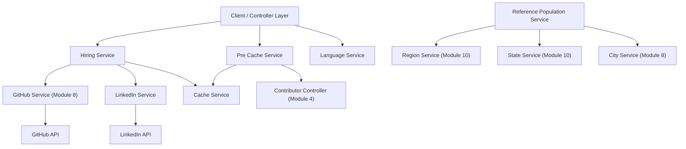
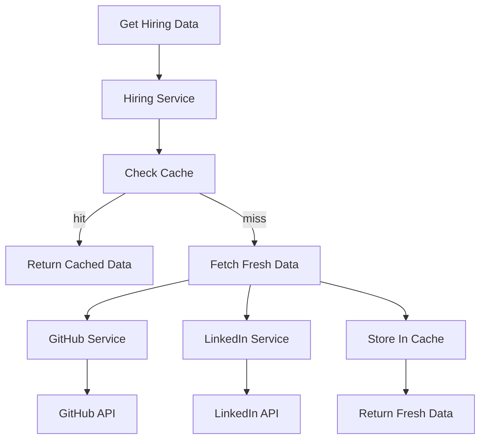
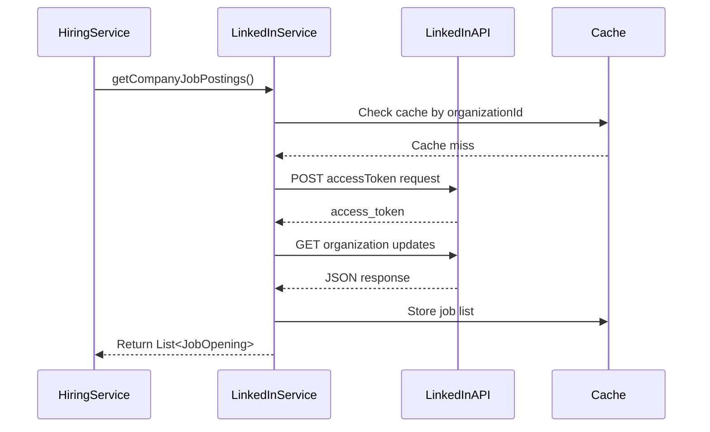
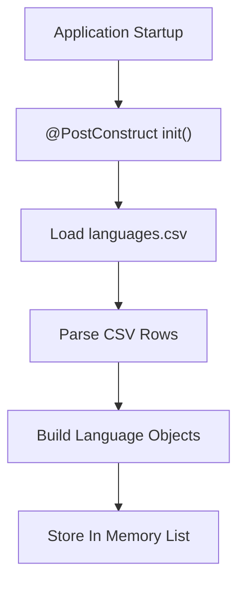
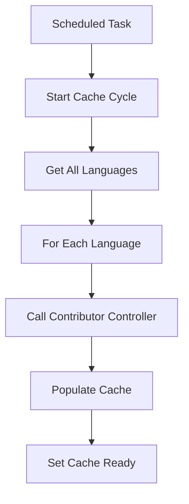
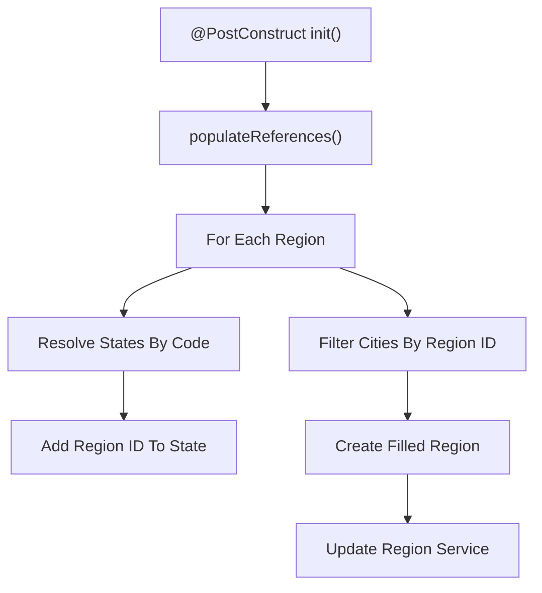

# Module 9

## Overview

Module 9 contains a set of backend services responsible for:

- Hiring and recruitment data aggregation
- Programming language reference management
- External LinkedIn integration
- Proactive cache warming
- Cross-entity reference population (regions, states, cities)

This module plays a central orchestration role between:

- External APIs (GitHub and LinkedIn)
- Internal domain models (Contributor, Language, Region, JobOpening, etc.)
- The caching layer
- Controllers and other service modules

It builds on:

- Core service integrations from Module 8 (e.g., GitHub, City services)
- Geographic and team services from Module 10
- Domain models defined in Modules 6 and 7

---

## Architectural Context

Module 9 sits in the backend service layer and coordinates external data retrieval, reference enrichment, and cache management.

---

## Core Services

Module 9 consists of five primary services:

1. Hiring Service  
2. LinkedIn Service  
3. Language Service  
4. Pre Cache Service  
5. Reference Population Service  

Each service has a distinct responsibility but integrates tightly with caching and the broader domain model.

---

## Hiring Service

**Class:** `HiringService`  

### Responsibilities

- Retrieve and cache the hiring manager profile
- Aggregate job openings from LinkedIn
- Provide fallback job listings if LinkedIn fails
- Wrap responses in a consistent API structure

### Key Behaviors

#### 1. Hiring Manager Profile Retrieval

- Uses GitHub Service (Module 8) to fetch a user profile
- Transforms a `Contributor` into a `HiringManagerProfile`
- Caches the result under the `hiring/manager_profile` key
- Respects a configurable refresh interval

#### 2. Job Openings Retrieval

- Delegates to LinkedIn Service for company job postings
- Falls back to predefined default jobs if API fails
- Caches job openings under `hiring/job_openings`

### Design Characteristics

- Strong reliance on `CacheServiceAbs` for performance
- Defensive fallback strategy for external API instability
- Clean separation between profile logic and job retrieval logic

---

## LinkedIn Service

**Class:** `LinkedInService`  

### Responsibilities

- Authenticate with LinkedIn using OAuth2 client credentials
- Retrieve organization updates
- Extract job posting information
- Transform LinkedIn JSON into `JobOpening` domain objects
- Cache LinkedIn job data

### External Interaction Flow

### Notable Features

- Uses `WebClient` for non-blocking HTTP calls (with blocking at boundary)
- JSON parsing via Gson
- Timeout enforcement for update requests
- Resilient fallback returning empty list on failure

---

## Language Service

**Class:** `LanguageService`  

### Responsibilities

- Load programming languages from `data/languages.csv`
- Provide autocomplete functionality
- Resolve language by ID
- Supply default language (Java)

### Initialization

- Executed at application startup via `@PostConstruct`
- Reads CSV from classpath
- Builds in-memory list of `Language` domain objects

### Functional Capabilities

- Case-insensitive filtering for autocomplete
- Stream-based filtering and limiting
- Safe copying when returning full list
- Enforced default language presence

This service acts as a lightweight in-memory reference provider and supports both filtering logic and pre-caching cycles.

---

## Pre Cache Service

**Class:** `PreCacheService`  

### Responsibilities

- Warm the contributor cache proactively
- Trigger full refresh cycles across all languages
- Mark cache readiness state

### Execution Model

- Uses `@Scheduled`
- Runs immediately after startup
- Iterates through all languages
- Calls Contributor Controller (Module 4) to force cache refresh

### Strategic Purpose

- Eliminates cold-start latency
- Ensures leaderboard data is ready
- Reduces first-request penalty

This service bridges controllers and the caching subsystem to ensure performance stability.

---

## Reference Population Service

**Class:** `ReferencePopulationService`  

### Responsibilities

- Populate bidirectional references between:
  - Regions
  - States
  - Cities
- Enrich domain objects after initial load
- Ensure consistent cross-entity relationships

### Initialization

- Triggered via `@PostConstruct`
- Calls `populateReferences()` at startup

### Reference Enrichment Flow

### Design Impact

- Converts ID-based references into fully connected object graphs
- Ensures Region objects contain:
  - Resolved `State` objects
  - Resolved `City` objects
- Maintains referential consistency across services

This service is essential for accurate geographic filtering and ranking logic.

---

## Cross-Module Dependencies

Module 9 integrates with several adjacent modules:

- Module 8  
  - GitHub Service
  - City Service
- Module 10  
  - Region Service
  - State Service
- Module 4  
  - Contributor Controller
- Modules 6 and 7  
  - Domain models such as Contributor, Language, Region, JobOpening

This positions Module 9 as a coordination and enrichment layer between raw data services and higher-level business workflows.

---

## Key Design Themes

### 1. Aggressive Caching

- All expensive operations cached
- Configurable refresh intervals
- Pre-warming strategy

### 2. External API Resilience

- Graceful fallback job listings
- Exception handling around LinkedIn calls
- Controlled timeouts

### 3. Domain Enrichment

- ID-to-object reference resolution
- Immutable rebuild strategy for enriched regions

### 4. Startup Optimization

- Language preloading
- Reference graph construction
- Immediate cache warming

---

## Summary

Module 9 is a service orchestration and optimization layer responsible for:

- Hiring-related data aggregation
- Language reference management
- LinkedIn job ingestion
- Cache warming cycles
- Geographic reference graph enrichment

It ensures that the Major League GitHub backend:

- Loads quickly
- Serves cached data efficiently
- Handles external API failures gracefully
- Maintains consistent and enriched domain relationships

Within the overall system, Module 9 enhances performance, reliability, and data completeness across the leaderboard and hiring features.