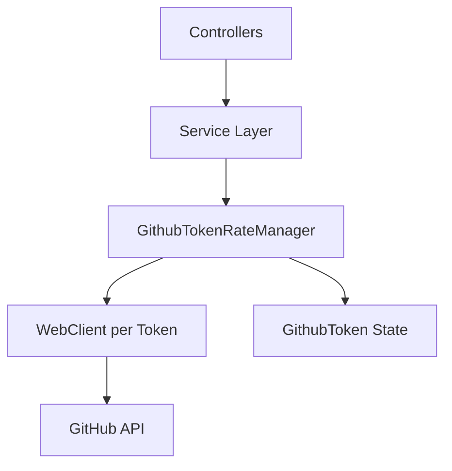
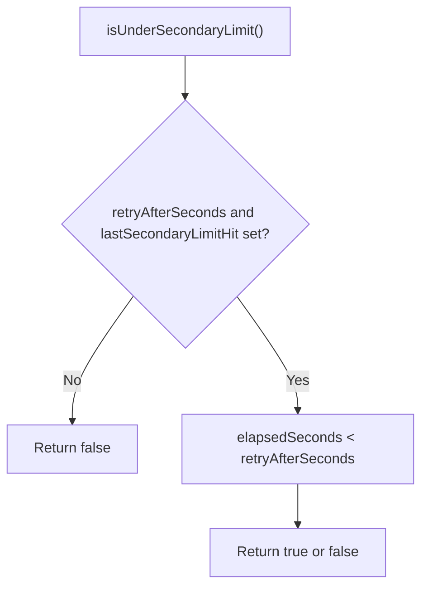
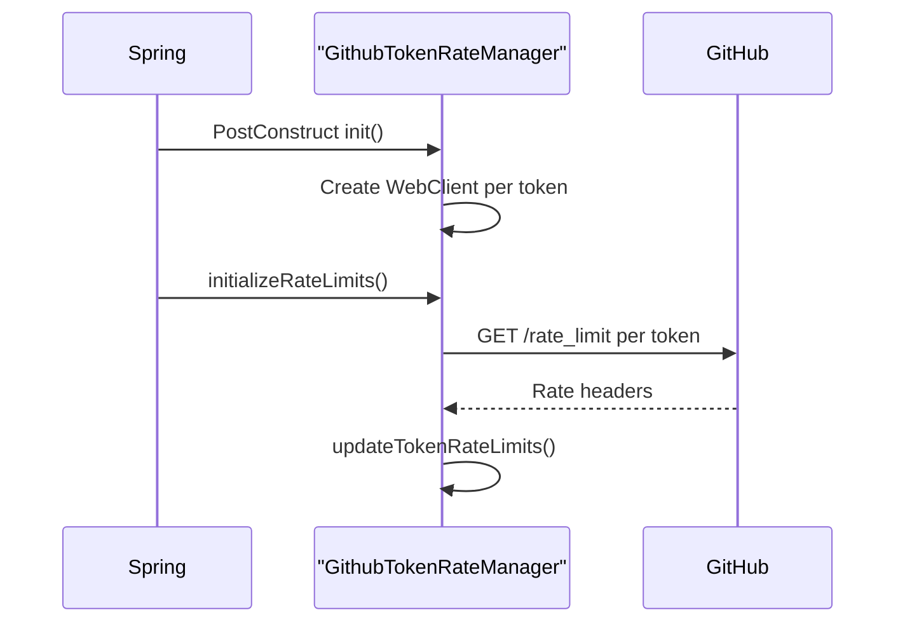
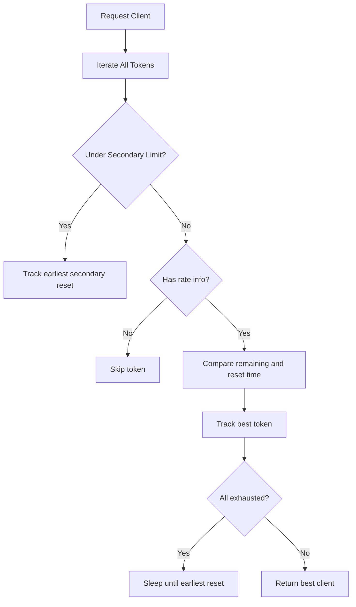
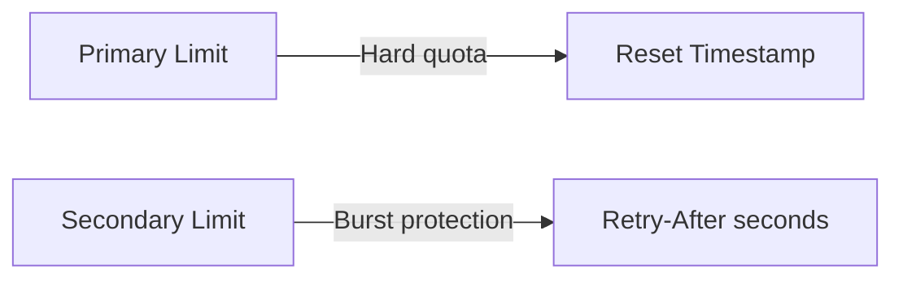
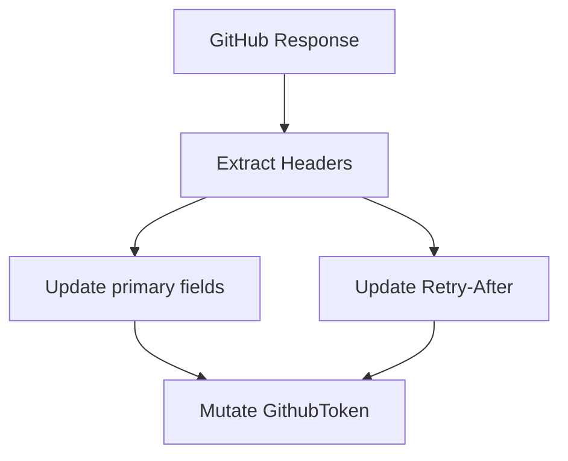

# Rate Management

## Overview

The **Rate Management** module is responsible for handling GitHub API rate limits across multiple access tokens in the Major League GitHub backend. Since the platform aggregates contributor and repository data from the GitHub GraphQL and REST APIs, it must operate within strict primary and secondary rate limits imposed by GitHub.

This module ensures:

- Safe and efficient use of multiple GitHub tokens
- Automatic detection of primary and secondary rate limits
- Intelligent token selection based on remaining capacity
- Blocking and retry behavior when all tokens are exhausted
- Centralized rate state tracking for all outbound GitHub API calls

At its core, the module consists of:

- `GithubToken` – A stateful model representing a single token and its rate metadata
- `GithubTokenRateManager` – A Spring-managed service responsible for token lifecycle, selection, and synchronization

---

## Architectural Context

The Rate Management module sits between the Service Layer (e.g., GitHub integration services) and the external GitHub API.



### Flow Summary

1. A service (e.g., GitHub data aggregation) needs to call GitHub.
2. It requests the best available `WebClient` from `GithubTokenRateManager`.
3. The manager selects the optimal token based on remaining quota and reset time.
4. After the call, response headers are used to update the token's rate metadata.
5. If limits are exceeded, the manager enforces wait logic before allowing further calls.

---

## Core Components

### 1. GithubToken

**Class:** `cx.flamingo.analysis.rate.GithubToken`

`GithubToken` is a state container representing the real-time rate status of a single GitHub access token.

#### Primary Rate Limit Fields

| Field | Description |
|--------|------------|
| `token` | Raw GitHub access token value |
| `remainingRequests` | Remaining calls from `X-RateLimit-Remaining` |
| `resetTime` | UNIX timestamp from `X-RateLimit-Reset` |
| `rateLimit` | Total limit from `X-RateLimit-Limit` |
| `usedRequests` | Used quota from `X-RateLimit-Used` |

#### Secondary Rate Limit Fields

| Field | Description |
|--------|------------|
| `retryAfterSeconds` | `Retry-After` header value |
| `lastSecondaryLimitHit` | Timestamp when secondary limit occurred |

#### Key Behaviors



- **`isUnderSecondaryLimit()`**
  - Determines if a token is temporarily blocked by GitHub secondary rate limiting.
  - Uses wall-clock time and `Retry-After` value.

- **`hasRemainingRequests()`**
  - Ensures the token has positive remaining quota.
  - Automatically excludes tokens under secondary limit.

- **`getSecondsUntilReset()`**
  - Calculates time until primary rate reset.
  - Returns 0 if already reset or not initialized.

This class is intentionally lightweight and mutable so that it can be updated dynamically after each GitHub API response.

---

### 2. GithubTokenRateManager

**Class:** `cx.flamingo.analysis.rate.GithubTokenRateManager`

This is a Spring `@Service` responsible for:

- Initializing token clients
- Fetching initial rate limit state
- Selecting the optimal token per request
- Handling exhaustion and wait logic
- Updating token state from response headers

---

## Initialization Lifecycle



### Token Map Structure

Internally the manager maintains:

- `HashMap<String, Pair<GithubToken, WebClient>> tokenMap`

Each configured token maps to:

- A `GithubToken` object (state)
- A dedicated `WebClient` configured with:
  - Base GitHub API URL
  - `Authorization: Bearer <token>` header
  - Increased buffer size (1MB)

This ensures:

- Isolation between tokens
- Clean state tracking per token
- Stateless consumers (services do not manage tokens directly)

---

## Intelligent Token Selection Algorithm

The heart of the module is:

```text
getBestAvailableClient()
```

### Selection Strategy



### Decision Rules

1. **Skip tokens under secondary limit**
   - Respect `Retry-After` duration.
   - Track earliest secondary reset.

2. **Skip tokens without rate info**
   - Ensures safe selection.

3. **Prefer token with:**
   - Highest `remainingRequests`
   - If tie → Latest `resetTime`

4. **If all tokens are exhausted:**
   - Sleep until earliest primary reset
   - Reinitialize limits
   - Retry selection recursively

5. **If all tokens are under secondary limit:**
   - Sleep until earliest secondary reset
   - Retry selection

This guarantees that the system:

- Maximizes throughput
- Avoids unnecessary failures
- Self-recovers from temporary rate exhaustion

---

## Primary vs Secondary Rate Limits

### Primary Rate Limit

- Controlled via headers:
  - `X-RateLimit-Remaining`
  - `X-RateLimit-Reset`
  - `X-RateLimit-Limit`
  - `X-RateLimit-Used`
- Reset occurs at a fixed UNIX timestamp.
- Hard quota enforcement.

### Secondary Rate Limit

- Triggered by abuse detection or burst traffic.
- Signaled via `Retry-After` header.
- No official remaining counter.
- Temporarily blocks the token.



The Rate Management module handles both transparently.

---

## Rate Limit Update Flow

After each GitHub API call, response headers should be passed into:

```text
updateTokenRateLimits(GithubToken token, Map<String, List<String>> headers)
```

### Header Processing

- Parses primary headers
- Parses `Retry-After`
- Updates token state
- Logs structured debug information



This design ensures state accuracy without requiring persistent storage.

---

## Concurrency and Synchronization

### Thread Safety Considerations

- `initializeRateLimits()` is `synchronized`
- Token selection is deterministic and based on in-memory state
- Blocking logic uses `Thread.sleep()` when required

Because this service is a singleton Spring bean, it acts as a centralized rate coordination point across all backend threads.

---

## Configuration Dependencies

The module relies on Spring configuration properties:

- `github.tokens` – List of GitHub access tokens
- `github.api.url.rate_limit` – Endpoint for rate limit inspection
- `github.api.url` – Base GitHub API URL

These values are injected via `@Value` annotations.

---

## Design Characteristics

### Strengths

- Multi-token load balancing
- Automatic backoff handling
- Primary + secondary limit awareness
- Minimal external dependencies
- Centralized coordination model

### Trade-offs

- Blocking wait using `Thread.sleep()`
- In-memory rate tracking (not distributed)
- Assumes single-instance coordination

For horizontally scaled deployments, a distributed coordination strategy (e.g., Redis-backed rate tracking) could extend this design.

---

## How It Fits Into the Overall System

Within the Major League GitHub backend architecture:

- Controllers expose REST endpoints.
- Services orchestrate business logic and GitHub queries.
- The Rate Management module ensures safe GitHub API usage.
- Cache services reduce redundant calls.
- Model entities represent domain objects returned to the frontend.

The Rate Management module acts as a protective boundary between internal services and GitHub, preventing quota exhaustion and service instability.

---

## Summary

The **Rate Management** module provides a robust, centralized mechanism for managing GitHub API limits across multiple tokens. It:

- Tracks real-time rate state per token
- Selects the most optimal token dynamically
- Handles both primary and secondary rate limits
- Self-recovers through intelligent waiting and reinitialization

Without this module, the application would risk frequent API failures, degraded performance, and quota exhaustion. It is a foundational reliability component of the backend system.