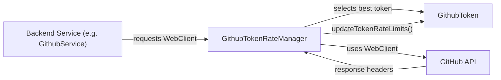
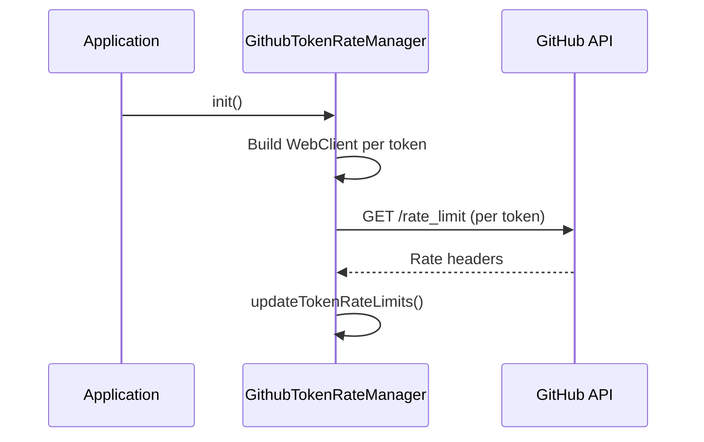
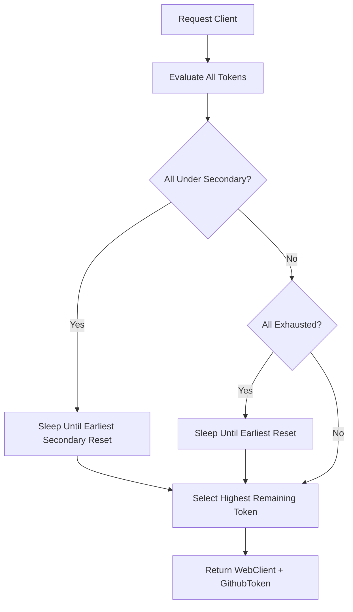

# Rate Management

## Overview

The **Rate Management** module is responsible for orchestrating and optimizing all outbound GitHub API calls in the Major League GitHub backend. Because the application relies heavily on GitHub’s REST and GraphQL APIs for contributor discovery, statistics, and search, respecting GitHub’s primary and secondary rate limits is critical for reliability.

This module:

- Manages multiple GitHub access tokens
- Tracks primary rate limits (request quotas per hour)
- Detects and handles secondary rate limits (abuse protection)
- Selects the optimal token for each outgoing API call
- Blocks and waits intelligently when all tokens are temporarily exhausted

The Rate Management module is primarily used by backend services such as `GithubService`, ensuring that all GitHub API interactions are rate-aware and resilient.

---

## Core Components

The module consists of two core classes:

1. **GithubToken**  
2. **GithubTokenRateManager**

### GithubToken

`GithubToken` is a data model representing a single GitHub API token and its associated rate limit state.

**Responsibilities:**

- Store primary rate limit metadata:
  - Remaining requests
  - Total limit
  - Reset time (Unix timestamp)
  - Used requests
- Track secondary rate limit state:
  - Retry-After duration
  - Timestamp of last secondary limit hit
- Provide helper methods for:
  - Checking availability
  - Computing seconds until reset
  - Determining if token is under secondary rate restriction

#### Primary vs Secondary Limits

- **Primary limit**: Standard per-hour quota (e.g., 5000 requests/hour per token).
- **Secondary limit**: GitHub’s abuse detection mechanism, triggered by high-frequency or burst traffic. Enforced via `Retry-After` headers.

Key logic:

- `hasRemainingRequests()` → true only if:
  - Remaining > 0
  - Not under secondary rate limit
- `isUnderSecondaryLimit()` → checks whether the retry window has elapsed.

---

### GithubTokenRateManager

`GithubTokenRateManager` is a Spring `@Service` responsible for:

- Initializing token-aware `WebClient` instances
- Fetching and updating rate limit metadata
- Selecting the best available token for outgoing requests
- Blocking and retrying when necessary

It acts as the central gateway for all GitHub API calls.

---

## Architecture Overview

The Rate Management module sits between backend services and GitHub’s API.

### Flow Summary

1. A backend service requests a GitHub client.
2. The Rate Manager selects the best token.
3. The API call is executed.
4. Response headers are parsed.
5. Token state is updated.

---

## Token Initialization Lifecycle

At application startup:

1. Tokens are injected via configuration (`github.tokens`).
2. For each token:
   - A `GithubToken` object is created.
   - A dedicated `WebClient` is built with:
     - Base URL
     - Authorization header
     - Increased memory buffer
3. `initializeRateLimits()` calls GitHub’s `/rate_limit` endpoint.
4. Each token’s metadata is populated.

---

## Token Selection Strategy

The `getBestAvailableClient()` method implements intelligent selection logic.

### Selection Criteria

For each token:

1. Skip tokens under secondary rate limit.
2. Skip tokens without rate metadata.
3. Prefer tokens with:
   - Highest remaining requests
   - Latest reset time (if tie)

### Exhaustion Handling

If all tokens are:

- **Under secondary limit** → Wait until earliest retry window expires.
- **Primary exhausted (remaining = 0)** → Wait until earliest reset timestamp.

This ensures:

- No unnecessary failures
- Full utilization of all configured tokens
- Graceful degradation under heavy load

---

## Rate Limit Updates

After each GitHub response, the manager extracts headers such as:

- `X-RateLimit-Remaining`
- `X-RateLimit-Reset`
- `X-RateLimit-Limit`
- `X-RateLimit-Used`
- `Retry-After`

These are parsed and injected into the associated `GithubToken`.

### Primary Limit Handling

- Remaining requests updated
- Reset timestamp updated
- Used requests tracked

### Secondary Limit Handling

When `Retry-After` is present:

- `retryAfterSeconds` is stored
- `lastSecondaryLimitHit` timestamp is recorded
- Token becomes temporarily unavailable

---

## Concurrency and Thread Safety

- `initializeRateLimits()` is `synchronized` to prevent double initialization.
- Token selection is deterministic and read-based.
- Blocking uses `Thread.sleep()` when waiting for reset windows.

While simple, this design ensures predictable behavior without requiring distributed coordination.

---

## Configuration Dependencies

The module relies on configuration values injected via Spring:

- `github.tokens` → List of personal access tokens
- `github.api.url` → Base GitHub API URL
- `github.api.url.rate_limit` → Rate limit endpoint

These are typically defined in the application configuration and loaded via the Configuration module.

---

## Interaction with Other Modules

The Rate Management module integrates with:

- **Backend Services** → Especially `GithubService`, which delegates API calls.
- **GraphQL Components** → When building and executing GitHub queries.
- **Cache Services** → Rate management ensures cache refreshes do not overwhelm GitHub.

It does not expose HTTP endpoints directly. Instead, it acts as an internal infrastructure service.

---

## Design Strengths

- ✅ Multi-token load balancing
- ✅ Intelligent wait-and-retry behavior
- ✅ Secondary rate limit awareness
- ✅ Transparent integration with WebClient
- ✅ Centralized rate logic

---

## Potential Extension Points

The module could be enhanced with:

- Non-blocking wait strategies (reactive delay instead of `Thread.sleep()`)
- Metrics export (Prometheus/Grafana integration)
- Distributed token coordination (Redis-backed state)
- Adaptive backoff strategies

---

## Summary

The **Rate Management** module ensures that Major League GitHub can scale GitHub API interactions safely and efficiently. By combining:

- Multi-token pooling
- Primary and secondary rate awareness
- Intelligent selection and wait strategies

it transforms GitHub’s strict rate limits into a manageable, resilient infrastructure layer for the entire backend system.
