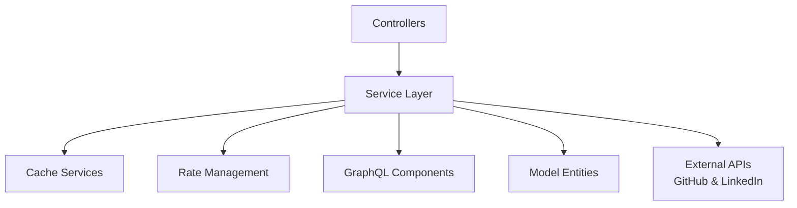
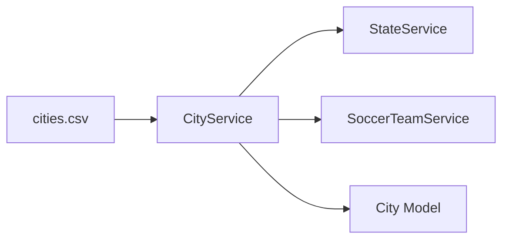
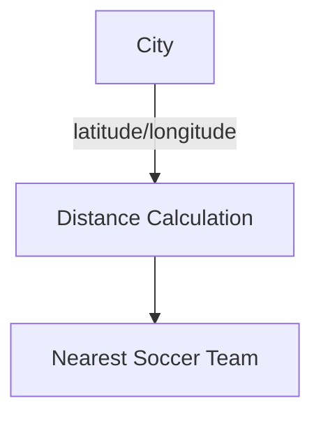
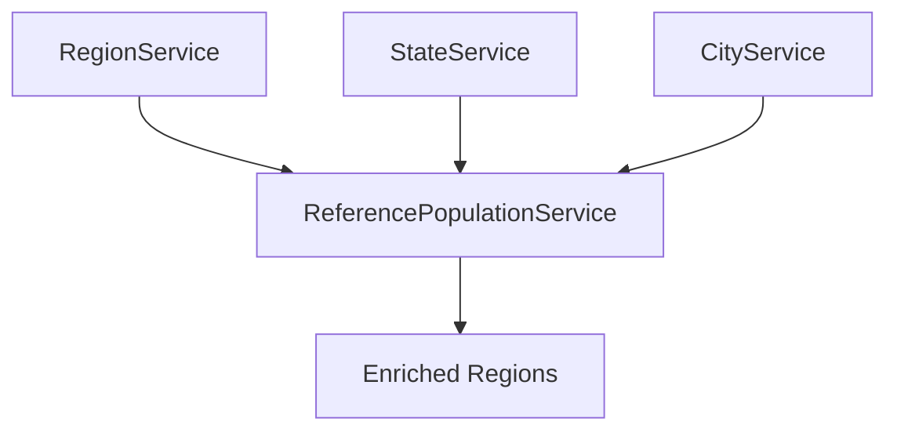
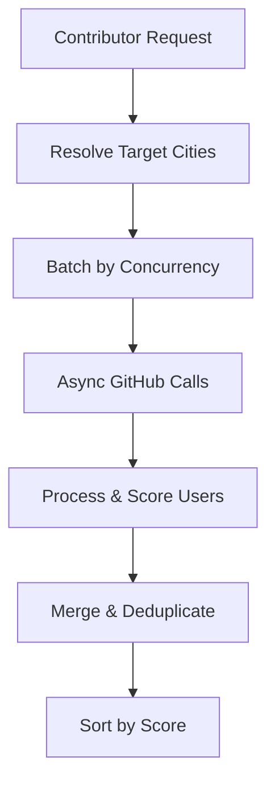
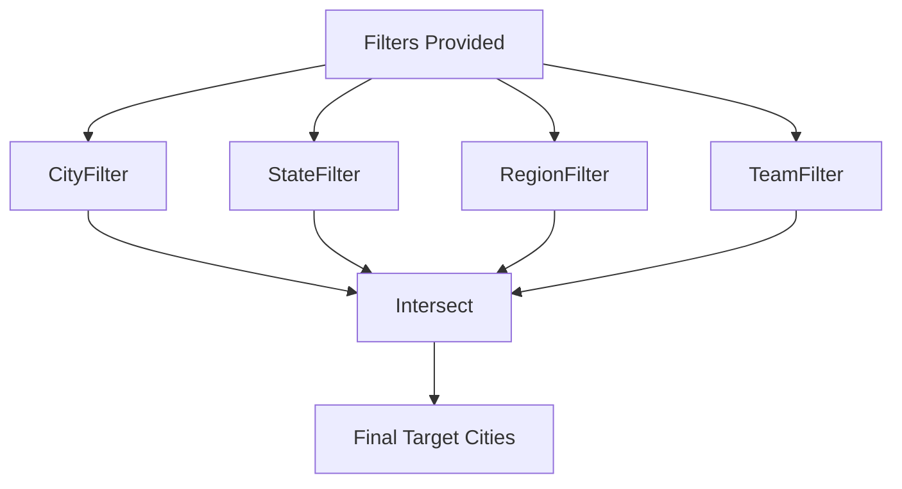
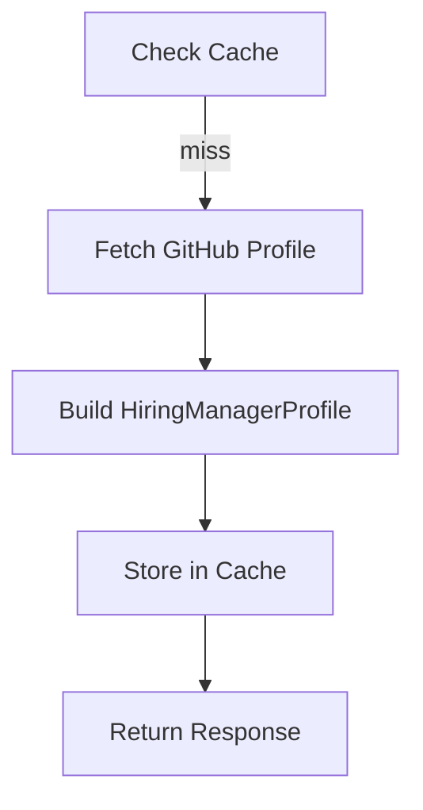
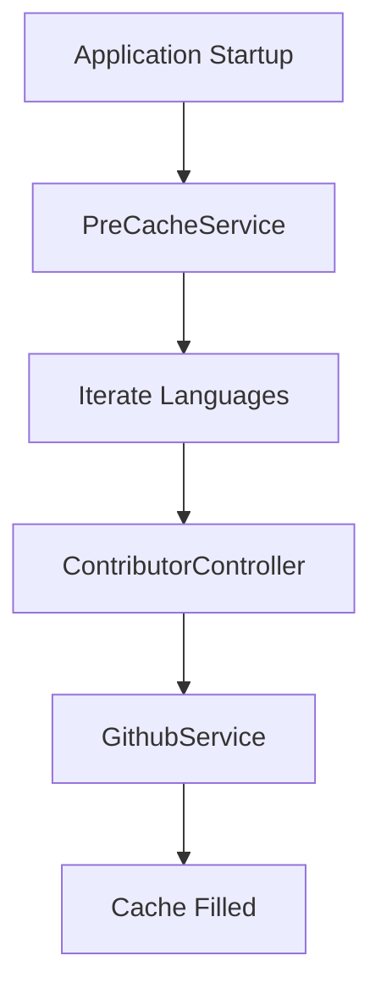
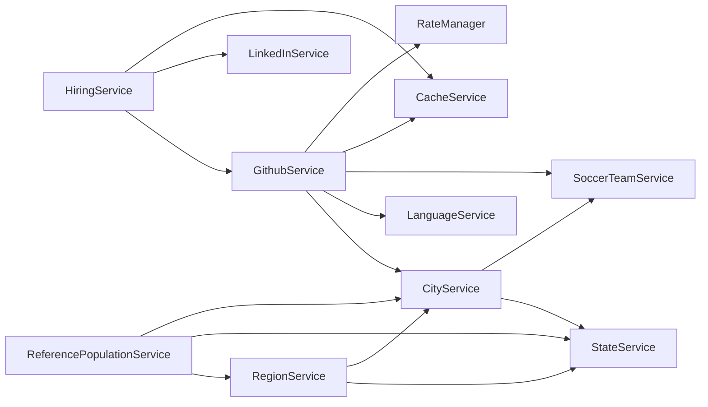

# Service Layer

## Overview

The **Service Layer** is the core business logic module of the Major League GitHub backend. It orchestrates data loading, GitHub and LinkedIn integrations, scoring logic, geographic filtering, and caching coordination.

This layer sits between the Controllers and the underlying infrastructure modules (cache services, rate management, GraphQL components, and model entities). It transforms raw external API responses and static CSV data into rich domain models such as `Contributor`, `City`, `Region`, and `SoccerTeam`.

At a high level, the Service Layer is responsible for:

- Loading and managing reference data (cities, states, regions, languages, teams)
- Fetching and ranking GitHub contributors using GraphQL
- Managing GitHub API rate limits and concurrency
- Enriching contributors with geography and soccer team proximity
- Integrating LinkedIn job postings for hiring features
- Pre-warming and maintaining cache readiness

---

## Architectural Position



The Service Layer:

- Receives filtered requests from Controllers.
- Coordinates with Cache Services to reduce API load.
- Uses Rate Management to safely consume GitHub tokens.
- Builds queries via GraphQL components.
- Produces enriched domain entities used by the frontend.

---

# Core Service Responsibilities

## 1. Geographic & Reference Data Services

These services load static reference data from CSV files at startup and provide filtering, enrichment, and cross-linking logic.

### CityService

**Purpose:**
- Loads cities from `data/cities.csv`
- Associates cities with regions and states
- Computes nearest soccer team using geographic distance

**Key Features:**
- Autocomplete by name, region, and state
- Sorting by population
- Lazy state population
- Filtering by nearest team



Cities are enriched with:
- State reference (via StateService)
- Nearest soccer team ID (via SoccerTeamService)

---

### StateService

**Purpose:**
- Loads states from `data/states.csv`
- Supports region-based filtering
- Calculates total population dynamically from cities

Population is derived dynamically from CityService rather than persisted.

---

### RegionService

**Purpose:**
- Loads regions from `data/regions.csv`
- Links regions to states and cities
- Supports filtering by state and city
- Sorts by total regional population

Regions initially load with ID references and are later enriched by ReferencePopulationService.

---

### SoccerTeamService

**Purpose:**
- Loads teams from `data/teams.csv`
- Calculates nearest team using Haversine distance
- Supports autocomplete by name, city, or state



This geographic coupling enables the sports-style leaderboard concept.

---

### LanguageService

**Purpose:**
- Loads languages from `data/languages.csv`
- Supports autocomplete
- Provides default language (Java)

Languages are critical for filtering GitHub searches.

---

### ReferencePopulationService

**Purpose:**
- Post-processes regions after startup
- Injects fully populated State and City references into Region objects



This avoids circular dependencies during initial CSV loading.

---

## 2. GitHub Integration & Contributor Scoring

### GithubService

**Purpose:**
- Builds GraphQL queries
- Executes GitHub API calls
- Manages concurrency and batching
- Calculates contributor scores
- Enriches contributors with city and team data

### High-Level Flow



### Key Capabilities

#### 1. Concurrency & Priority

Two thread pools:
- High priority executor
- Low priority executor

Requests are batched based on configurable `github.api.concurrency`.

---

#### 2. Rate Limit Handling

GithubService integrates with GithubTokenRateManager:

- Selects best available token
- Updates rate limits from response headers
- Switches tokens when limits are hit
- Handles:
  - Timeout
  - Rate limit exceeded
  - Secondary rate limit
  - Forbidden or expired tokens

---

#### 3. Caching Integration

All GraphQL calls are wrapped with CacheServiceAbs:

- Cache key includes city, language, and page number
- Empty results are cached
- Reduces repeated API load

---

#### 4. Contributor Scoring Formula

Score formula:

```text
score = commits × max(starsReceived, 1) × recencyMultiplier
```

Where:
- `recencyMultiplier` ranges from 1.0 to 2.0
- Based on commit activity within the past year

This ensures:
- Active developers rank higher
- High-impact repositories increase ranking

---

#### 5. Data Enrichment

Each contributor is enriched with:

- City (matched from GitHub location)
- Nearest soccer team
- Social links (GitHub, email, website, Twitter, Mastodon, Bluesky, etc.)
- Language-specific repository statistics

The service also detects social media platforms dynamically from URLs.

---

### Target City Resolution

GithubService resolves intersections between:

- City
- State
- Region
- Soccer team



This flexible intersection logic enables advanced geographic filtering.

---

## 3. Hiring & LinkedIn Integration

### HiringService

**Purpose:**
- Exposes hiring manager profile
- Retrieves job openings
- Uses caching with refresh interval

Profile generation flow:



If cache exists and is valid, GitHub is not called.

---

### LinkedInService

**Purpose:**
- Retrieves organization job postings
- Performs OAuth client credentials flow
- Parses LinkedIn updates API
- Caches job results

If LinkedIn fails, HiringService falls back to default static job entries.

---

## 4. Cache Warm-Up & Readiness

### PreCacheService

**Purpose:**
- Automatically runs after startup
- Iterates through all languages
- Triggers contributor loading
- Marks cache as ready



This ensures the leaderboard is responsive immediately after deployment.

---

# Internal Dependency Graph



---

# Lifecycle & Initialization Order

1. CSV-based services load data at startup (`@PostConstruct`).
2. ReferencePopulationService enriches region references.
3. PreCacheService triggers initial contributor loading.
4. Cache is marked ready.

This design ensures:
- Deterministic reference data
- No external calls required for base geography
- GitHub load distributed across tokens
- Fast subsequent responses via cache

---

# Design Characteristics

## Strengths

- Clear separation of concerns
- Resilient external API handling
- Multi-token rate limit management
- Intelligent contributor scoring
- Geographic and sports-themed enrichment
- Startup cache warm-up for performance

## Trade-Offs

- Heavy reliance on GitHub GraphQL schema stability
- CSV-based static reference data requires redeploy for updates
- LinkedIn API changes may affect job parsing

---

# Summary

The **Service Layer** is the orchestration engine of Major League GitHub. It:

- Connects geography to developer data
- Applies scoring logic to rank contributors
- Safely consumes external APIs
- Maintains cache efficiency
- Powers both leaderboard and hiring features

It transforms raw GitHub and LinkedIn data into a sports-inspired, geographically aware developer ranking system.