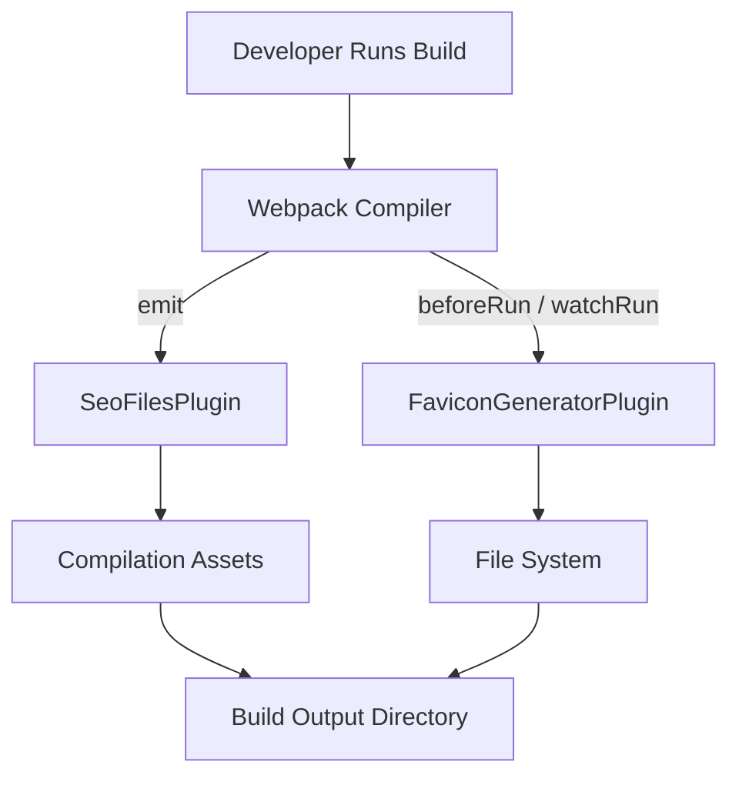
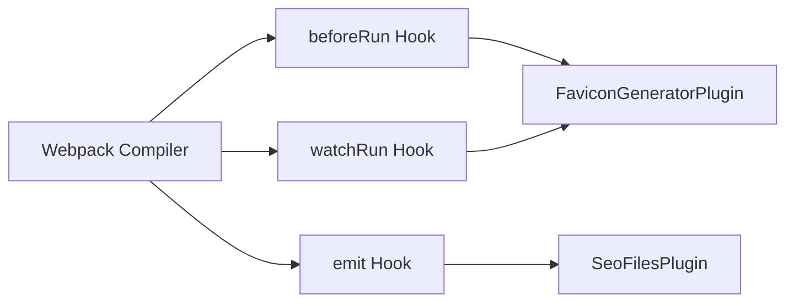
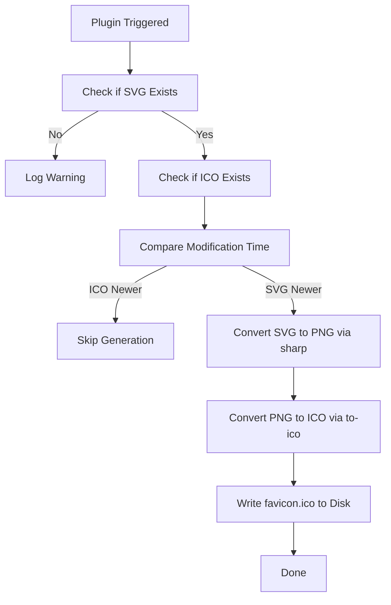
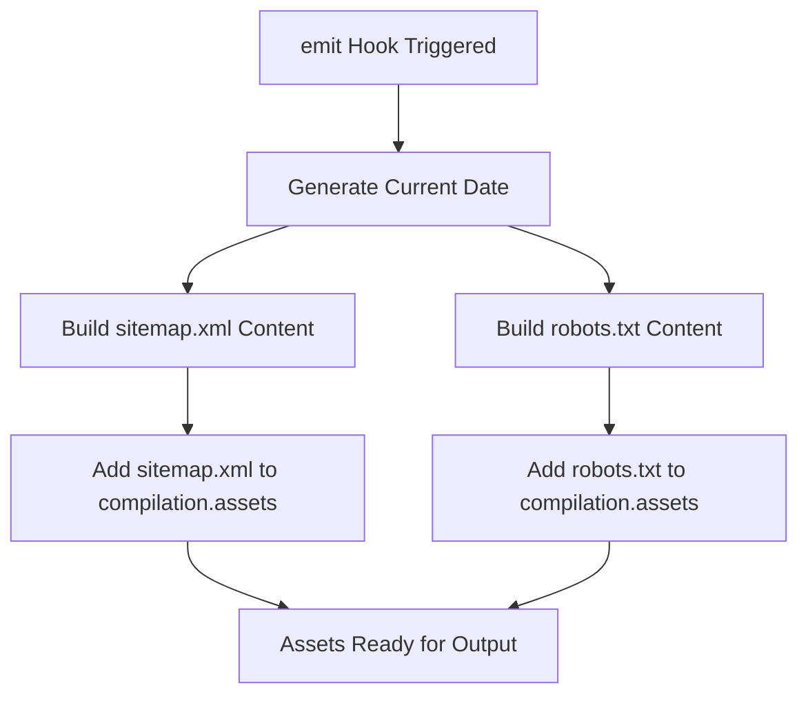
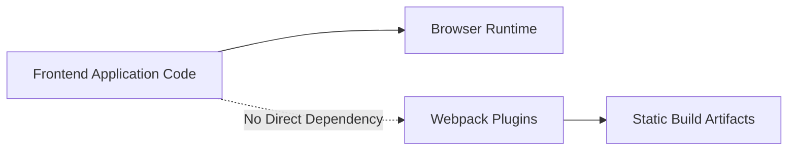

# Webpack Plugins

The **Webpack Plugins** module contains custom build-time extensions for the Major League GitHub frontend. These plugins enhance the Webpack compilation lifecycle by generating static assets and SEO-related files automatically during the build process.

This module is part of the frontend toolchain and operates entirely at build time. It does not ship runtime code to the browser. Instead, it integrates with Webpack’s plugin system to:

- Generate a production-ready `favicon.ico` from an SVG source
- Produce SEO-critical files such as `sitemap.xml` and `robots.txt`

By encapsulating this logic in custom plugins, the project ensures consistent asset generation across local development and CI/CD pipelines.

---

## Architectural Overview

The Webpack Plugins module integrates directly with the Webpack compiler lifecycle. Each plugin hooks into specific compilation phases to inject or transform build artifacts.

### Key Characteristics

- **Build-time execution only**
- **Zero runtime overhead** in the browser bundle
- **Deterministic asset generation**
- **CI/CD friendly**

---

## Plugin Lifecycle Integration

Webpack exposes lifecycle hooks that plugins can subscribe to. The two plugins in this module use different hooks depending on their responsibilities.

- **FaviconGeneratorPlugin** runs before compilation starts (both normal and watch mode).
- **SeoFilesPlugin** runs during the `emit` phase to inject generated files into the output bundle.

---

## FaviconGeneratorPlugin

**Core Component:**  
`major-league-github.frontend.webpack-plugins.favicon-generator-plugin.FaviconGeneratorPlugin`

### Purpose

Automatically generates a `favicon.ico` file from an SVG source file during the build process.

This ensures:

- A single source of truth (`favicon.svg`)
- Automatic regeneration when the SVG changes
- Consistent output for all environments

### Configuration Options

| Option | Description | Default |
|---------|------------|----------|
| `svgPath` | Path to the source SVG file | `public/favicon.svg` |
| `icoPath` | Output path for generated ICO file | `public/favicon.ico` |
| `size` | Icon size in pixels | `60` |

### Internal Workflow

### Optimization Strategy

The plugin avoids unnecessary work by:

- Checking if the SVG file exists
- Comparing modification timestamps
- Skipping regeneration if the ICO file is already up to date

This improves incremental build performance, especially in watch mode.

### External Dependencies

- **sharp** – Image processing (SVG → PNG conversion)
- **to-ico** – Converts PNG buffer to ICO format
- **fs / path** – Node.js filesystem utilities

### Error Handling

- Logs warnings if the SVG file is missing
- Throws build errors if image conversion fails
- Ensures output directory exists before writing files

---

## SeoFilesPlugin

**Core Component:**  
`major-league-github.frontend.webpack-plugins.seo-files-plugin.SeoFilesPlugin`

### Purpose

Generates SEO-related static files during the Webpack `emit` phase:

- `sitemap.xml`
- `robots.txt`

These files are injected directly into the Webpack compilation assets and included in the final output bundle.

### Configuration Options

| Option | Description | Default |
|---------|------------|----------|
| `baseUrl` | Base site URL used in generated files | `https://www.mlg.soccer` |

### Internal Workflow

### Generated Artifacts

#### sitemap.xml

- Includes homepage URL
- Sets daily change frequency
- Sets priority to `1.0`
- Uses current date as `lastmod`

#### robots.txt

- Allows all crawlers
- Disallows `/api/` routes
- References generated sitemap

### Design Considerations

- Uses Webpack’s asset injection system
- Avoids filesystem writes during build
- Ensures generated files are part of the final artifact

---

## Responsibilities Within the Frontend Architecture

The Webpack Plugins module supports the frontend build pipeline by providing:

| Concern | Responsibility |
|----------|----------------|
| Branding | Generate consistent favicon from SVG |
| SEO | Provide sitemap and crawler configuration |
| Automation | Eliminate manual asset management |
| Performance | Avoid redundant file generation |

It complements frontend components, hooks, services, and types by enhancing the production build rather than modifying runtime behavior.

---

## Separation of Concerns

- The application code does not depend on these plugins.
- The plugins do not modify application logic.
- They operate strictly at build time.

---

## Benefits of the Approach

1. **Single Source of Truth** – SVG-based favicon management.
2. **SEO Automation** – Always up-to-date sitemap and robots configuration.
3. **Build Consistency** – Works identically in local and CI environments.
4. **Incremental Efficiency** – Avoids redundant image processing.
5. **Clear Responsibility Boundary** – Isolated build-time concerns.

---

## Summary

The **Webpack Plugins** module encapsulates build-time automation logic for the Major League GitHub frontend. It enhances the Webpack pipeline through two focused plugins:

- **FaviconGeneratorPlugin** – Converts SVG to ICO efficiently and conditionally.
- **SeoFilesPlugin** – Injects SEO-critical static files during compilation.

Together, they ensure the application’s static assets and search engine configuration remain accurate, automated, and production-ready without introducing runtime complexity.