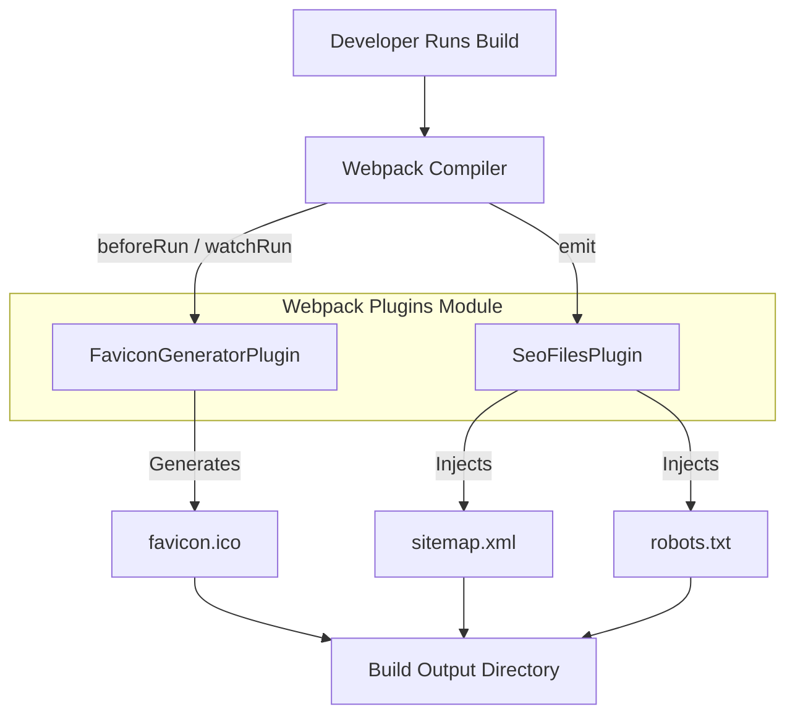
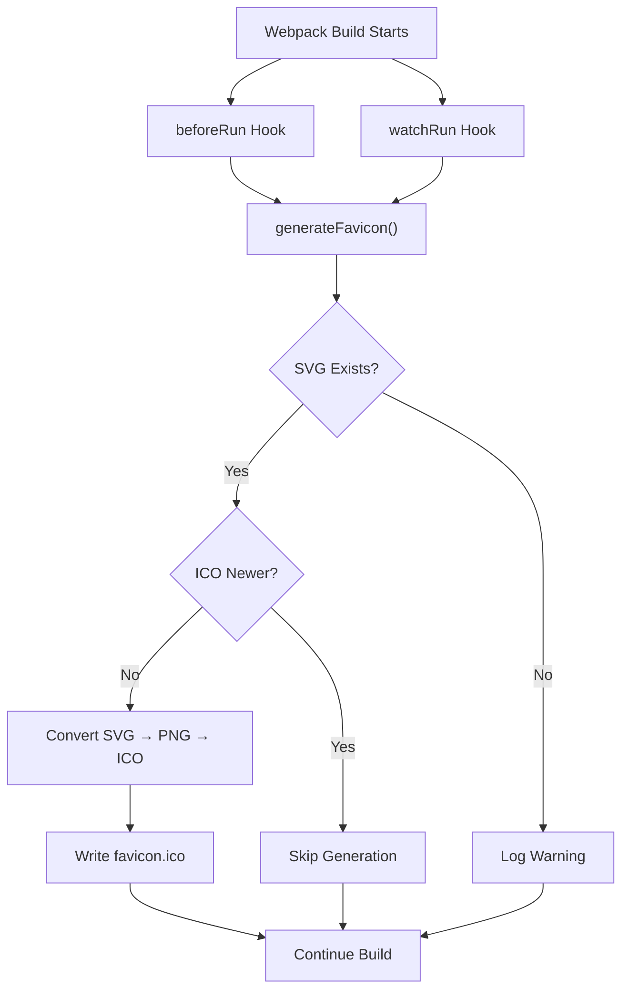
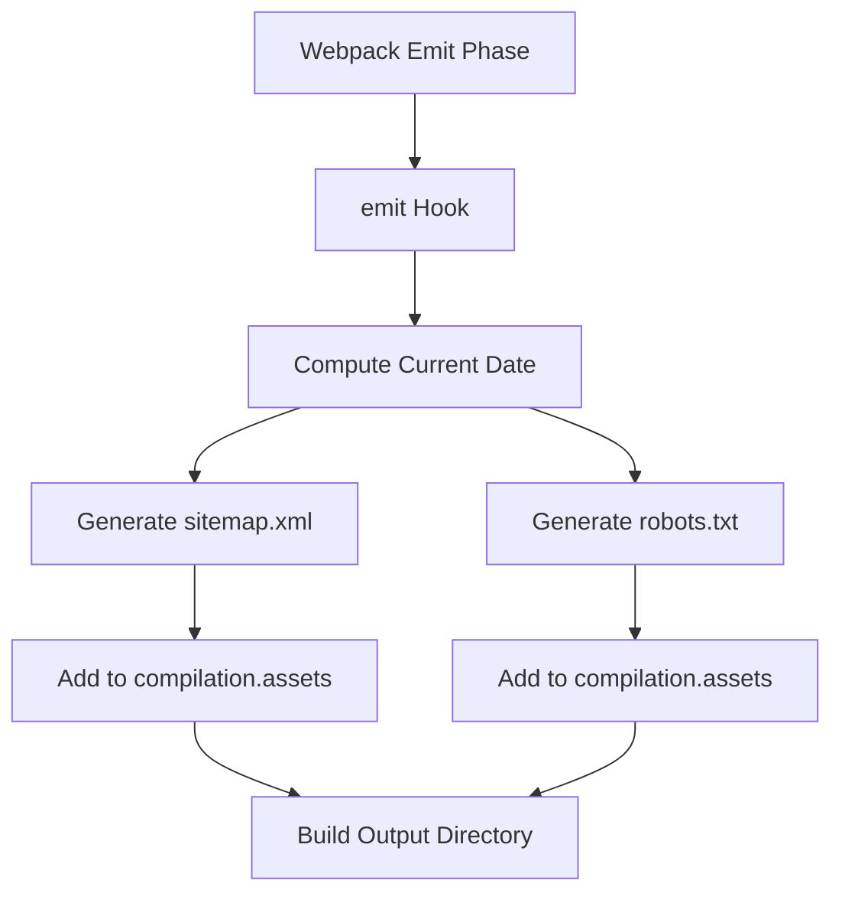
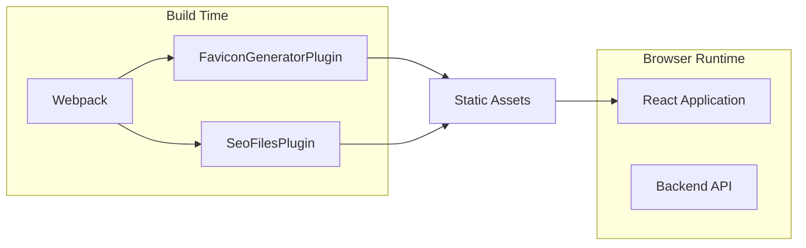

# Webpack Plugins

The **Webpack Plugins** module contains custom build-time extensions used by the Major League GitHub frontend. These plugins enhance the Webpack compilation process by generating static assets that are not directly produced by the React application itself.

This module currently provides:

- **FaviconGeneratorPlugin** – Automatically generates a `favicon.ico` file from an SVG source.
- **SeoFilesPlugin** – Dynamically generates `sitemap.xml` and `robots.txt` during the Webpack build.

Together, these plugins ensure that branding and SEO-related assets are always consistent, up to date, and environment-aware.

---

## Module Responsibilities

The Webpack Plugins module is responsible for:

1. Extending the Webpack build lifecycle via custom hooks.
2. Generating derived static assets (ICO from SVG).
3. Injecting SEO-related files directly into the build output.
4. Ensuring build artifacts remain synchronized with source files.

These plugins operate purely at **build time** and do not affect runtime performance in the browser.

---

## Architectural Overview

### Key Points

- Plugins hook into the **Webpack compiler lifecycle**.
- Output files are injected into the final build artifact.
- No runtime code changes are required in the React application.

---

# FaviconGeneratorPlugin

## Purpose

The **FaviconGeneratorPlugin** ensures that a `favicon.ico` file is always generated from a source SVG file. This prevents manual conversion steps and keeps the favicon aligned with the latest branding updates.

## Core Features

- Converts SVG → PNG → ICO
- Skips regeneration if the ICO file is newer than the SVG
- Works in both normal build mode and watch mode
- Automatically creates output directories if missing

## Build Lifecycle Integration

## Internal Workflow

1. Resolve SVG and ICO paths relative to the Webpack context.
2. Validate that the SVG file exists.
3. Compare modification timestamps.
4. Use:
   - `sharp` for SVG → PNG conversion.
   - `to-ico` for PNG → ICO conversion.
5. Persist the generated `favicon.ico` to disk.

## Configuration Options

| Option | Default | Description |
|--------|---------|------------|
| `svgPath` | `public/favicon.svg` | Path to the source SVG file |
| `icoPath` | `public/favicon.ico` | Output path for the ICO file |
| `size` | `60` | Resize dimension before ICO conversion |

## Why This Matters

- Prevents stale favicon artifacts.
- Ensures SVG remains the single source of truth.
- Reduces manual asset management errors.

---

# SeoFilesPlugin

## Purpose

The **SeoFilesPlugin** generates search engine optimization files dynamically during the Webpack build:

- `sitemap.xml`
- `robots.txt`

This ensures that deployments always include consistent and environment-aware SEO metadata.

## Build Lifecycle Integration

## Generated Files

### sitemap.xml

Includes:
- Base URL
- Current build date as `<lastmod>`
- Change frequency
- Priority value

### robots.txt

Includes:
- Allow all crawlers
- Disallow `/api/`
- Reference to sitemap location

## Configuration Options

| Option | Default | Description |
|--------|---------|------------|
| `baseUrl` | `https://www.mlg.soccer` | Root URL used in sitemap and robots file |

## Design Characteristics

- Generated entirely in memory during compilation.
- Injected directly into `compilation.assets`.
- No filesystem writes required.
- Automatically reflects the current build date.

---

# Interaction with the Frontend Application

Although these plugins live alongside the frontend codebase, they:

- Do not modify React components.
- Do not impact bundle size directly.
- Operate strictly during the Webpack compilation phase.

They complement:

- **Frontend Components** (UI rendering)
- **Frontend Services** (API communication)
- **Frontend Types** (TypeScript domain models)

by ensuring that build artifacts meet production readiness standards.

---

# Build-Time vs Runtime Responsibilities

## Summary

The **Webpack Plugins** module enhances the frontend build pipeline by:

- Automating favicon generation from SVG sources.
- Ensuring SEO metadata is always present and correct.
- Keeping branding and indexing artifacts synchronized with each build.

By embedding these concerns directly into the Webpack lifecycle, the system ensures consistent, reproducible, and production-ready frontend builds without adding runtime complexity.